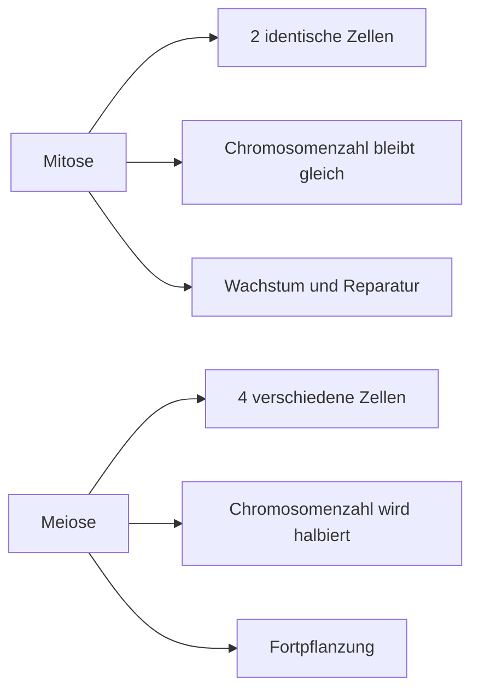

<mark class="red"> Disclaimer: </mark>  Dieses Dokument wurde von mir für private Zwecke erstellt. Es dient ausschließlich zur Unterstützung des Lernens und der Informationsverbreitung. Ich übernehme keine Haftung für mögliche Fehler, Ungenauigkeiten oder Missverständnisse. Die Nutzung erfolgt auf eigene Verantwortung.

- [[#1. Präbiotiosche Evolution: Entstehung der ersten Zelle|1. Präbiotiosche Evolution: Entstehung der ersten Zelle]]
	- [[#1. Präbiotiosche Evolution: Entstehung der ersten Zelle#Die Zelle - was ist das ?|Die Zelle - was ist das ?]]
	- [[#1. Präbiotiosche Evolution: Entstehung der ersten Zelle#Zwei grundsätzliche Zelltypen im Organismenreich|Zwei grundsätzliche Zelltypen im Organismenreich]]
		- [[#Zwei grundsätzliche Zelltypen im Organismenreich#Gemeinsame Merkmale pro- und eukaryotischer Zellen:|Gemeinsame Merkmale pro- und eukaryotischer Zellen:]]
		- [[#Zwei grundsätzliche Zelltypen im Organismenreich#Unterschiede Prokaryotisch vs Eukaryotisch:|Unterschiede Prokaryotisch vs Eukaryotisch:]]
	- [[#1. Präbiotiosche Evolution: Entstehung der ersten Zelle#Wie ist die erste Zelle entstanden ?|Wie ist die erste Zelle entstanden ?]]
		- [[#Wie ist die erste Zelle entstanden ?#Abiotische Synthese organischer Polymere|Abiotische Synthese organischer Polymere]]
			- [[#Abiotische Synthese organischer Polymere#Miller-Urey-Experiment|Miller-Urey-Experiment]]
		- [[#Wie ist die erste Zelle entstanden ?#Makromoleküle + Selbstreplizierende Polymere|Makromoleküle + Selbstreplizierende Polymere]]
		- [[#Wie ist die erste Zelle entstanden ?#Die erste Zelle = Protobionten|Die erste Zelle = Protobionten]]
	- [[#1. Präbiotiosche Evolution: Entstehung der ersten Zelle#Die Evolution des Metabolismus|Die Evolution des Metabolismus]]
	- [[#1. Präbiotiosche Evolution: Entstehung der ersten Zelle#Entstehung der ersten Eukaryoten|Entstehung der ersten Eukaryoten]]
		- [[#Entstehung der ersten Eukaryoten#Die Endosymbiontentheorie|Die Endosymbiontentheorie]]
	- [[#1. Präbiotiosche Evolution: Entstehung der ersten Zelle#Die Entstehung vielzelliger Organismen|Die Entstehung vielzelliger Organismen]]
- [[#2. Bausteine des Lebens|2. Bausteine des Lebens]]
	- [[#2. Bausteine des Lebens#Vielfalt des Lebens – Domänen der Lebewesen|Vielfalt des Lebens – Domänen der Lebewesen]]
	- [[#2. Bausteine des Lebens#5 Essentielle Bausteine des Lebens|5 Essentielle Bausteine des Lebens]]
		- [[#5 Essentielle Bausteine des Lebens#Bausteine des Lebens sind Makromoleküle|Bausteine des Lebens sind Makromoleküle]]
	- [[#2. Bausteine des Lebens#Proteine|Proteine]]
		- [[#Proteine#Funktionen von Proteinen/9 Hauptklassen|Funktionen von Proteinen/9 Hauptklassen]]
		- [[#Proteine#Proteine sind Polypeptide aus Aminosäuren|Proteine sind Polypeptide aus Aminosäuren]]
			- [[#Proteine sind Polypeptide aus Aminosäuren#Peptidbindung: Verknüpfung von Aminosäuren|Peptidbindung: Verknüpfung von Aminosäuren]]
		- [[#Proteine#Faltung und Stabilität von Proteinen|Faltung und Stabilität von Proteinen]]
			- [[#Faltung und Stabilität von Proteinen#Proteine: vier Ebenen der Struktur|Proteine: vier Ebenen der Struktur]]
		- [[#Proteine#Beispiel: Hämoglobin (roter Blutfarbstoff)|Beispiel: Hämoglobin (roter Blutfarbstoff)]]
	- [[#2. Bausteine des Lebens#Nukleinsäuren|Nukleinsäuren]]
		- [[#Nukleinsäuren#Aufbau + Struktur|Aufbau + Struktur]]
		- [[#Nukleinsäuren#Struktur der DNA-Doppelhelix|Struktur der DNA-Doppelhelix]]
	- [[#2. Bausteine des Lebens#Kohlenhydrate|Kohlenhydrate]]
		- [[#Kohlenhydrate#Monosaccharide|Monosaccharide]]
			- [[#Monosaccharide#Glucose|Glucose]]
		- [[#Kohlenhydrate#Disaccharide|Disaccharide]]
			- [[#Disaccharide#Saccharose (Rohrzucker)|Saccharose (Rohrzucker)]]
		- [[#Kohlenhydrate#Polysaccharide: Speicher + Baustoff|Polysaccharide: Speicher + Baustoff]]
			- [[#Polysaccharide: Speicher + Baustoff#Speicherpolysaccharide|Speicherpolysaccharide]]
			- [[#Polysaccharide: Speicher + Baustoff#Strukturpolysachharide|Strukturpolysachharide]]
	- [[#2. Bausteine des Lebens#Lipide|Lipide]]
		- [[#Lipide#Fette: Gesättigte und ungesättigte Fettsäuren|Fette: Gesättigte und ungesättigte Fettsäuren]]
		- [[#Lipide#Phospholipide|Phospholipide]]
- [[#3. Membran+Kompartimentierung|3. Membran+Kompartimentierung]]
	- [[#3. Membran+Kompartimentierung#Aufgaben von Membranen|Aufgaben von Membranen]]
	- [[#3. Membran+Kompartimentierung#Zelluläre Membranen – Phospholipid-Doppelschicht|Zelluläre Membranen – Phospholipid-Doppelschicht]]
	- [[#3. Membran+Kompartimentierung#Fluidität von Membranen|Fluidität von Membranen]]
		- [[#Fluidität von Membranen#Warum müssen Membranen flüssig sein?|Warum müssen Membranen flüssig sein?]]
		- [[#Fluidität von Membranen#Regulation der Membranfluidität|Regulation der Membranfluidität]]
	- [[#3. Membran+Kompartimentierung#Membranproteine: Flüssig-Mosaik-Modell|Membranproteine: Flüssig-Mosaik-Modell]]
		- [[#Membranproteine: Flüssig-Mosaik-Modell#Membranproteine: integral und peripher|Membranproteine: integral und peripher]]
		- [[#Membranproteine: Flüssig-Mosaik-Modell#Asymmetrie von Membranen|Asymmetrie von Membranen]]
		- [[#Membranproteine: Flüssig-Mosaik-Modell#Transmembranproteine = integrale Proteine|Transmembranproteine = integrale Proteine]]
		- [[#Membranproteine: Flüssig-Mosaik-Modell#Beweglichkeit von Membranproteinen|Beweglichkeit von Membranproteinen]]
	- [[#3. Membran+Kompartimentierung#Membranen gewährleisten selektiven Stofftransport|Membranen gewährleisten selektiven Stofftransport]]
		- [[#Membranen gewährleisten selektiven Stofftransport#1. Einfache Diffusion: Bewegung entlang eines Gradienten|1. Einfache Diffusion: Bewegung entlang eines Gradienten]]
				- [[#Strukturpolysachharide#Semi-permeable Membranen und Wasserbalance|Semi-permeable Membranen und Wasserbalance]]
		- [[#Membranen gewährleisten selektiven Stofftransport#2. Erleichterte Diffusion: proteinvermittelt|2. Erleichterte Diffusion: proteinvermittelt]]
		- [[#Membranen gewährleisten selektiven Stofftransport#3.+4. Aktiver Transport|3.+4. Aktiver Transport]]
- [[#4. Zellkern|4. Zellkern]]
	- [[#4. Zellkern#Der Informationsfluss innerhalb der Zelle|Der Informationsfluss innerhalb der Zelle]]
	- [[#4. Zellkern#Das Genetische Material|Das Genetische Material]]
		- [[#Das Genetische Material#Der Nachweis des genetischen Materials|Der Nachweis des genetischen Materials]]
		- [[#Das Genetische Material#Die DNA Struktur|Die DNA Struktur]]
			- [[#Die DNA Struktur#Bestimmung der Dna-Zusammensetzung|Bestimmung der Dna-Zusammensetzung]]
			- [[#Die DNA Struktur#Organisation der DNA in Genomen|Organisation der DNA in Genomen]]
				- [[#Organisation der DNA in Genomen#Die Organisation der DNA: Nucleosomen|Die Organisation der DNA: Nucleosomen]]
				- [[#Organisation der DNA in Genomen#Die Verpackungsebenen der DNA|Die Verpackungsebenen der DNA]]
			- [[#Die DNA Struktur#Euchromatin und Heterochromatin im Zellkern|Euchromatin und Heterochromatin im Zellkern]]
	- [[#4. Zellkern#Der Aufbau des Zellkerns|Der Aufbau des Zellkerns]]
		- [[#Der Aufbau des Zellkerns#Transport IN und AUS dem Zellkern|Transport IN und AUS dem Zellkern]]
			- [[#Transport IN und AUS dem Zellkern#Zellkernporen: Struktur und Aufbau|Zellkernporen: Struktur und Aufbau]]
		- [[#Der Aufbau des Zellkerns#Zellkern - Nucleolus|Zellkern - Nucleolus]]
		- [[#Der Aufbau des Zellkerns#Ribosomen: Proteinfabriken der Zelle|Ribosomen: Proteinfabriken der Zelle]]
			- [[#Ribosomen: Proteinfabriken der Zelle#Zwei Typen von Ribosomen|Zwei Typen von Ribosomen]]
	- [[#4. Zellkern#Vom Zellkern zum Endomembransystem|Vom Zellkern zum Endomembransystem]]
		- [[#Vom Zellkern zum Endomembransystem#Endomembransystem - Aufgaben|Endomembransystem - Aufgaben]]
			- [[#Endomembransystem - Aufgaben#Hauptaufgaben des Endomembransystems:|Hauptaufgaben des Endomembransystems:]]
		- [[#Vom Zellkern zum Endomembransystem#Das Endoplasmatische Reticulum (ER)|Das Endoplasmatische Reticulum (ER)]]
			- [[#Das Endoplasmatische Reticulum (ER)#Aufgaben des glatten ERs:|Aufgaben des glatten ERs:]]
			- [[#Das Endoplasmatische Reticulum (ER)#Aufgaben des rauen ERs:|Aufgaben des rauen ERs:]]
- [[#5. Endomembransystem|5. Endomembransystem]]
	- [[#5. Endomembransystem#ATP VS GTP|ATP VS GTP]]
	- [[#5. Endomembransystem#Der Golgi-Apparat: Fracht- und Umbauzentrum|Der Golgi-Apparat: Fracht- und Umbauzentrum]]
		- [[#Der Golgi-Apparat: Fracht- und Umbauzentrum#Wie finden Proteine ihren Zielort?|Wie finden Proteine ihren Zielort?]]
		- [[#Der Golgi-Apparat: Fracht- und Umbauzentrum#Aufbau des Golgi-Apparats|Aufbau des Golgi-Apparats]]
		- [[#Der Golgi-Apparat: Fracht- und Umbauzentrum#Weitere Aufgaben des Golgi-Apparats|Weitere Aufgaben des Golgi-Apparats]]
		- [[#Der Golgi-Apparat: Fracht- und Umbauzentrum#Transport durch den Golgi-Apparat|Transport durch den Golgi-Apparat]]
			- [[#Transport durch den Golgi-Apparat#Exocytose: Freisetzung von Proteinen|Exocytose: Freisetzung von Proteinen]]
				- [[#Exocytose: Freisetzung von Proteinen#Mechanismus der Exocytose|Mechanismus der Exocytose]]
		- [[#Der Golgi-Apparat: Fracht- und Umbauzentrum#Der Golgi-Apparat: Aufgaben|Der Golgi-Apparat: Aufgaben]]
			- [[#Der Golgi-Apparat: Aufgaben#Ein Beispiel für Protein-Prozessierung: Lysosomen|Ein Beispiel für Protein-Prozessierung: Lysosomen]]
				- [[#Ein Beispiel für Protein-Prozessierung: Lysosomen#Lysosome|Lysosome]]
			- [[#Der Golgi-Apparat: Aufgaben#Lysosomen: Aufgaben|Lysosomen: Aufgaben]]
			- [[#Der Golgi-Apparat: Aufgaben#Der Golgi-Apparat: spezialisierte Vesikeltypen|Der Golgi-Apparat: spezialisierte Vesikeltypen]]
				- [[#Der Golgi-Apparat: spezialisierte Vesikeltypen#Vakuolen: Mehrzweckorganellen|Vakuolen: Mehrzweckorganellen]]
- [[#6. Mitochondrien + Chloroplasten|6. Mitochondrien + Chloroplasten]]
	- [[#6. Mitochondrien + Chloroplasten#Chloroplasten: Einfangen von Lichtenergie|Chloroplasten: Einfangen von Lichtenergie]]
		- [[#Chloroplasten: Einfangen von Lichtenergie#Chloroplasten bestehen aus 3 Membransystemen|Chloroplasten bestehen aus 3 Membransystemen]]
			- [[#Chloroplasten bestehen aus 3 Membransystemen#Chloroplasten und Photosynthese|Chloroplasten und Photosynthese]]
				- [[#Chloroplasten und Photosynthese#Chloroplasten: Orte der Photosynthese|Chloroplasten: Orte der Photosynthese]]
	- [[#6. Mitochondrien + Chloroplasten#Mitochondrien: Umwandlung chemischer Energie|Mitochondrien: Umwandlung chemischer Energie]]
		- [[#Mitochondrien: Umwandlung chemischer Energie#Mitochondrien: umgeben von 2 Membranen|Mitochondrien: umgeben von 2 Membranen]]
			- [[#Mitochondrien: umgeben von 2 Membranen#Zusammenfassung der Zellatmung|Zusammenfassung der Zellatmung]]
				- [[#Zusammenfassung der Zellatmung#Mitochondrien: Orte der Zellatmung|Mitochondrien: Orte der Zellatmung]]
	- [[#6. Mitochondrien + Chloroplasten#Photosynthese und Zellatmung im Kreislauf|Photosynthese und Zellatmung im Kreislauf]]
		- [[#Photosynthese und Zellatmung im Kreislauf#Unterschiede und Gemeinsamkeiten der Zellatmung und Photosynthese:|Unterschiede und Gemeinsamkeiten der Zellatmung und Photosynthese:]]
			- [[#Unterschiede und Gemeinsamkeiten der Zellatmung und Photosynthese:#Gemeinsamkeiten:|Gemeinsamkeiten:]]
			- [[#Unterschiede und Gemeinsamkeiten der Zellatmung und Photosynthese:#Unterschiede:|Unterschiede:]]
			- [[#Unterschiede und Gemeinsamkeiten der Zellatmung und Photosynthese:#Kreisprozess:|Kreisprozess:]]
- [[#7. Cytoskelett, ECM + Zellwand|7. Cytoskelett, ECM + Zellwand]]
	- [[#7. Cytoskelett, ECM + Zellwand#Aufgaben des Cytoskeletts|Aufgaben des Cytoskeletts]]
	- [[#7. Cytoskelett, ECM + Zellwand#Das Cytoskelett: Organisation und Struktur|Das Cytoskelett: Organisation und Struktur]]
		- [[#Das Cytoskelett: Organisation und Struktur#Cytoskelett: innere Organisation und Aktivität|Cytoskelett: innere Organisation und Aktivität]]
			- [[#Cytoskelett: innere Organisation und Aktivität#Cytoskelett-Komponenten: Mikrotubuli|Cytoskelett-Komponenten: Mikrotubuli]]
				- [[#Cytoskelett-Komponenten: Mikrotubuli#Mikrotubuli – Motilität|Mikrotubuli – Motilität]]
			- [[#Cytoskelett: innere Organisation und Aktivität#Cytoskelett-Komponenten: Mikrofilamente|Cytoskelett-Komponenten: Mikrofilamente]]
				- [[#Cytoskelett-Komponenten: Mikrofilamente#Beispiel: Amöboide Bewegung|Beispiel: Amöboide Bewegung]]
				- [[#Cytoskelett-Komponenten: Mikrofilamente#Mikrofilamente und Muskelkontraktion|Mikrofilamente und Muskelkontraktion]]
				- [[#Cytoskelett-Komponenten: Mikrofilamente#Ergänzende Übersicht zur Muskelbewegung|Ergänzende Übersicht zur Muskelbewegung]]
			- [[#Cytoskelett: innere Organisation und Aktivität#Cytoskelett-Komponenten: Intermediärfilamente|Cytoskelett-Komponenten: Intermediärfilamente]]
		- [[#Das Cytoskelett: Organisation und Struktur#Außerhalb der Plasmamembran|Außerhalb der Plasmamembran]]
			- [[#Außerhalb der Plasmamembran#Zellwand von Pflanzenzellen|Zellwand von Pflanzenzellen]]
			- [[#Außerhalb der Plasmamembran#Die Extrazelluläre Matrix (ECM) tierischer Zellen|Die Extrazelluläre Matrix (ECM) tierischer Zellen]]
- [[#8. Zellverband und Zellkommunikation|8. Zellverband und Zellkommunikation]]
	- [[#8. Zellverband und Zellkommunikation#Vielzelligkeit|Vielzelligkeit]]
		- [[#Vielzelligkeit#Merkmale von Vielzellern|Merkmale von Vielzellern]]
		- [[#Vielzelligkeit#Voraussetzungen für Vielzelligkeit|Voraussetzungen für Vielzelligkeit]]
	- [[#8. Zellverband und Zellkommunikation#Zellverband und Zellkontakte|Zellverband und Zellkontakte]]
		- [[#Zellverband und Zellkontakte#Zellkontakte: Funktionale Gruppen|Zellkontakte: Funktionale Gruppen]]
			- [[#Zellkontakte: Funktionale Gruppen#1. **Verschließende Verbindungen** (Tight Junctions)|1. **Verschließende Verbindungen** (Tight Junctions)]]
			- [[#Zellkontakte: Funktionale Gruppen#2. **Haftverbindungen** (Adherens Junctions, Desmosomen, Hemidesmosomen)|2. **Haftverbindungen** (Adherens Junctions, Desmosomen, Hemidesmosomen)]]
			- [[#Zellkontakte: Funktionale Gruppen#3. **Kommunizierende Verbindungen** (Gap Junctions, Plasmodesmen)|3. **Kommunizierende Verbindungen** (Gap Junctions, Plasmodesmen)]]
	- [[#8. Zellverband und Zellkommunikation#Übersicht der Zellkontakte|Übersicht der Zellkontakte]]
		- [[#Übersicht der Zellkontakte#Bedeutung von Zellkontakten|Bedeutung von Zellkontakten]]
	- [[#8. Zellverband und Zellkommunikation#Plasmodesmen: Kommunizierende Zellverbindungen in Pflanzenzellen|Plasmodesmen: Kommunizierende Zellverbindungen in Pflanzenzellen]]
		- [[#Plasmodesmen: Kommunizierende Zellverbindungen in Pflanzenzellen#Definition|Definition]]
		- [[#Plasmodesmen: Kommunizierende Zellverbindungen in Pflanzenzellen#Aufbau|Aufbau]]
		- [[#Plasmodesmen: Kommunizierende Zellverbindungen in Pflanzenzellen#Funktion|Funktion]]
		- [[#Plasmodesmen: Kommunizierende Zellverbindungen in Pflanzenzellen#Bildung von Plasmodesmen|Bildung von Plasmodesmen]]
		- [[#Plasmodesmen: Kommunizierende Zellverbindungen in Pflanzenzellen#Expertenwissen: Dynamik der Plasmodesmen|Expertenwissen: Dynamik der Plasmodesmen]]
		- [[#Plasmodesmen: Kommunizierende Zellverbindungen in Pflanzenzellen#Bedeutung der Plasmodesmen|Bedeutung der Plasmodesmen]]
	- [[#8. Zellverband und Zellkommunikation#Zellverbindungen tierischer Zellen: Zellpolarität|Zellverbindungen tierischer Zellen: Zellpolarität]]
		- [[#Zellverbindungen tierischer Zellen: Zellpolarität#Definition der Zellpolarität|Definition der Zellpolarität]]
		- [[#Zellverbindungen tierischer Zellen: Zellpolarität#Zellverbindungen und ihre Funktion|Zellverbindungen und ihre Funktion]]
			- [[#Zellverbindungen und ihre Funktion#1. Verschließende Verbindungen|1. Verschließende Verbindungen]]
			- [[#Zellverbindungen und ihre Funktion#2. Adhäsionsverbindungen|2. Adhäsionsverbindungen]]
			- [[#Zellverbindungen und ihre Funktion#3. Kommunizierende Verbindungen|3. Kommunizierende Verbindungen]]
		- [[#Zellverbindungen tierischer Zellen: Zellpolarität#Übersicht der Zellverbindungen und Polarität|Übersicht der Zellverbindungen und Polarität]]
		- [[#Zellverbindungen tierischer Zellen: Zellpolarität#Bedeutung der Zellverbindungen|Bedeutung der Zellverbindungen]]
		- [[#Zellverbindungen tierischer Zellen: Zellpolarität#1. Verschließende Zellverbindungen: Tight Junctions|1. Verschließende Zellverbindungen: Tight Junctions]]
		- [[#Zellverbindungen tierischer Zellen: Zellpolarität#2. Haftende Zellverbindungen: Adherens Junctions|2. Haftende Zellverbindungen: Adherens Junctions]]
		- [[#Zellverbindungen tierischer Zellen: Zellpolarität#3. Kommunizierende Zellverbindungen: Gap Junctions|3. Kommunizierende Zellverbindungen: Gap Junctions]]
		- [[#Zellverbindungen tierischer Zellen: Zellpolarität#Zusammenfassung der Zellverbindungen|Zusammenfassung der Zellverbindungen]]
	- [[#8. Zellverband und Zellkommunikation#Zellverbindungen: Unterschiede zwischen Vertebraten und Invertebraten|Zellverbindungen: Unterschiede zwischen Vertebraten und Invertebraten]]
		- [[#Zellverbindungen: Unterschiede zwischen Vertebraten und Invertebraten#1. Verschließende Zellverbindungen|1. Verschließende Zellverbindungen]]
		- [[#Zellverbindungen: Unterschiede zwischen Vertebraten und Invertebraten#2. Haftende Zellverbindungen|2. Haftende Zellverbindungen]]
		- [[#Zellverbindungen: Unterschiede zwischen Vertebraten und Invertebraten#3. Kommunizierende Zellverbindungen|3. Kommunizierende Zellverbindungen]]
		- [[#Zellverbindungen: Unterschiede zwischen Vertebraten und Invertebraten#Zusammenfassung der Unterschiede|Zusammenfassung der Unterschiede]]
- [[#9. Zellteilung: Mitose und Meiose|9. Zellteilung: Mitose und Meiose]]
	- [[#9. Zellteilung: Mitose und Meiose#Zellteilung – Erzeugung von Nachkommen gleicher Art|Zellteilung – Erzeugung von Nachkommen gleicher Art]]
	- [[#9. Zellteilung: Mitose und Meiose#Zellteilung – Zellzyklus|Zellteilung – Zellzyklus]]
		- [[#Zellteilung – Zellzyklus#Youtube-Video-Zusammenfassung|Youtube-Video-Zusammenfassung]]
	- [[#9. Zellteilung: Mitose und Meiose#Zellzyklusphasen|Zellzyklusphasen]]
		- [[#Zellzyklusphasen#G1-Phase (Gap 1)|G1-Phase (Gap 1)]]
		- [[#Zellzyklusphasen#S-Phase (Synthesephase)|S-Phase (Synthesephase)]]
		- [[#Zellzyklusphasen#G2-Phase (Gap 2)|G2-Phase (Gap 2)]]
		- [[#Zellzyklusphasen#M-Phase (Mitose)|M-Phase (Mitose)]]
	- [[#9. Zellteilung: Mitose und Meiose#Das Chromosom|Das Chromosom]]
		- [[#Das Chromosom#Aufbau eines Chromosoms:|Aufbau eines Chromosoms:]]
	- [[#9. Zellteilung: Mitose und Meiose#Verteilung der DNA bei der Zellteilung|Verteilung der DNA bei der Zellteilung]]
	- [[#9. Zellteilung: Mitose und Meiose#Am Ende der Interphase|Am Ende der Interphase]]
	- [[#9. Zellteilung: Mitose und Meiose#Der Zellzyklus – Mitosestadien|Der Zellzyklus – Mitosestadien]]
		- [[#Der Zellzyklus – Mitosestadien#Eselsbrücke: **"Peter Plagt, Mich Am Telefon."**|Eselsbrücke: **"Peter Plagt, Mich Am Telefon."**]]
		- [[#Der Zellzyklus – Mitosestadien#Prophase|Prophase]]
		- [[#Der Zellzyklus – Mitosestadien#Prometaphase|Prometaphase]]
		- [[#Der Zellzyklus – Mitosestadien#Metaphase|Metaphase]]
		- [[#Der Zellzyklus – Mitosestadien#Anaphase|Anaphase]]
		- [[#Der Zellzyklus – Mitosestadien#Telophase und Cytokinese|Telophase und Cytokinese]]
	- [[#9. Zellteilung: Mitose und Meiose#Chromosomentrennung und -wanderung|Chromosomentrennung und -wanderung]]
		- [[#Chromosomentrennung und -wanderung#Chromosomentrennung|Chromosomentrennung]]
		- [[#Chromosomentrennung und -wanderung#Chromosomenwanderung|Chromosomenwanderung]]
	- [[#9. Zellteilung: Mitose und Meiose#Zellteilungen bei der Fortpflanzung/Vermehrung|Zellteilungen bei der Fortpflanzung/Vermehrung]]
	- [[#9. Zellteilung: Mitose und Meiose#Arten der Vermehrung|Arten der Vermehrung]]
	- [[#9. Zellteilung: Mitose und Meiose#Begriffe: Gen, Allel, Genlocus|Begriffe: Gen, Allel, Genlocus]]
	- [[#9. Zellteilung: Mitose und Meiose#Geschlechtliche Fortpflanzung – Keimzellen|Geschlechtliche Fortpflanzung – Keimzellen]]
	- [[#9. Zellteilung: Mitose und Meiose#Meiose – Reduktion des Chromosomensatzes|Meiose – Reduktion des Chromosomensatzes]]
		- [[#Meiose – Reduktion des Chromosomensatzes#1. Meiose I: Trennung homologer Chromosomen|1. Meiose I: Trennung homologer Chromosomen]]
		- [[#Meiose – Reduktion des Chromosomensatzes#2. Meiose II: Trennung der Schwesterchromatiden|2. Meiose II: Trennung der Schwesterchromatiden]]
	- [[#9. Zellteilung: Mitose und Meiose#Zusatzinformationen: Videozusammenfassung|Zusatzinformationen: Videozusammenfassung]]
		- [[#Zusatzinformationen: Videozusammenfassung#Ablauf der Meiose:|Ablauf der Meiose:]]
	- [[#9. Zellteilung: Mitose und Meiose#Meiose und Mitose: Unterschiede und Gemeinsamkeiten|Meiose und Mitose: Unterschiede und Gemeinsamkeiten]]
	- [[#9. Zellteilung: Mitose und Meiose#Vorgänge der Meiose als Motor der Evolution|Vorgänge der Meiose als Motor der Evolution]]
		- [[#Vorgänge der Meiose als Motor der Evolution#Mechanismen der genetischen Vielfalt:|Mechanismen der genetischen Vielfalt:]]
	- [[#9. Zellteilung: Mitose und Meiose#Mitose – Meiose: ein Überblick|Mitose – Meiose: ein Überblick]]
	- [[#9. Zellteilung: Mitose und Meiose#1. Mitose – Die „normale“ Zellteilung|1. Mitose – Die „normale“ Zellteilung]]
	- [[#9. Zellteilung: Mitose und Meiose#2. Meiose – Die „Sonderform“ der Zellteilung|2. Meiose – Die „Sonderform“ der Zellteilung]]
	- [[#9. Zellteilung: Mitose und Meiose#Unterschiede und Gemeinsamkeiten|Unterschiede und Gemeinsamkeiten]]
		- [[#Unterschiede und Gemeinsamkeiten#Gemeinsamkeiten|Gemeinsamkeiten]]
	- [[#9. Zellteilung: Mitose und Meiose#Fachbegriffe|Fachbegriffe]]


---
# 1. Präbiotiosche Evolution: Entstehung der ersten Zelle
## Die Zelle - was ist das ?
>[!info] Definition Zelle
>**Zelle**: = einfachste / kleinste Funktionseinheit eines größeren Systems

>[!info] Die Zelle trägt alle Eigenschaften des Lebens
>- Stoffwechsel / Metabolismus: ER, Golgi, Lysosomen, Vakuolen
>- Bewegung / Motilität: Cytoskelett, Flagellen
>- Vermehrung / Vererbung: Zellkern
>- Reizbarkeit: Membranproteine, Rezeptoren
>$\implies$ Es können auch einzelne Zellen Leben (**Protisten**)
## Zwei grundsätzliche Zelltypen im Organismenreich
<mark class="blue"> prokaryotisch </mark>: Archaea(Urbakterien) + Bacteria
<mark class="red"> eukaryotisch </mark>: Protisten, Pilze, Pflanzen, Tiere

>[!info]
>Als **Eukaryoten** oder auch Eukaryo**n**ten werden die Lebewesen bezeichnet, deren Zellen einen **Zellkern** besitzen. 
>
>Die Zellen der **Prokaryoten**, auch Prokaryo**n**ten, enthalten **keinen Zellkern**.
>
>>[!important]
>>Die Zellen der **Eukaryoten** bezeichnest du auch als _Euzyten_ oder _Eucyten_.
>> Die Zellen der **Prokaryoten** nennst du _Prozyten_ beziehungsweise _Procyten_.

### Gemeinsame Merkmale pro- und eukaryotischer Zellen:
- von einer **Plasmamembran** umgeben 
- Zellbestandteile in **Cytosol** (= flüssiges Cytoplasma) eingebettet 
- Vorhandensein von Chromosomen, Träger der Erbinformation (**DNA**) 
- Vorhandensein von **Ribosomen** als Orte der **Proteinsynthese**

### Unterschiede Prokaryotisch vs Eukaryotisch: 

|           <span style="color:rgb(0, 176, 240)">Prokaryotische Zelle</span>            |                           <span style="color:rgb(0, 176, 80)">Eukaryotische Zelle</span>                            |
| :-----------------------------------------------------------------------------------: | :-----------------------------------------------------------------------------------------------------------------: |
|      <span style="color:rgb(0, 176, 240)">- typische Zellgröße: 1 – 5 μm</span>       |                    <span style="color:rgb(0, 176, 80)">- typische Zellgröße: 10 – 100 μm</span>                     |
|            <span style="color:rgb(0, 176, 240)">- keine Kernmembran</span>            |                   <span style="color:rgb(0, 176, 80)">- echter Zellkern mit Doppelmembran</span>                    |
|              <span style="color:rgb(0, 176, 240)">- 70S Ribosomen</span>              |                             <span style="color:rgb(0, 176, 80)">- 80S Ribosomen</span>                              |
|           <span style="color:rgb(0, 176, 240)">- Plasmide vorhanden</span>            |                             <span style="color:rgb(0, 176, 80)">- keine Plasmide</span>                             |
| <span style="color:rgb(0, 176, 240)">- Fehlen von membranumgrenzten Organellen</span> | <span style="color:rgb(0, 176, 80)">Organellen - System innerer Membranen$\implies$Kompartimente = Organelle</span> |
![[Pasted image 20241027154332.png]]
>[!info] Kompartimente = Organellen
>Kompartimente schaffen verschiedene Reaktionsräume für verschiedene Stoffwechselaufgaben gleichzeitiges Ablaufen inkompatibler Vorgänge
>
>Das macht Eukaryoten fähig verschiedene Stoffwechselaufgaben parallel ablaufen zu lassen

>[!quizfrage] Was besitzt eine prokaryotische Zelle NICHT?
>a) DNA 
>b) Plasmide 
>c) Ribosomen 
**d) Kernmembran** 
>e) Plasmamembran
## Wie ist die erste Zelle entstanden ?
![[Pasted image 20241027154834.png]]
![[Bildschirmfoto 2024-10-27 um 15.53.02.png]]
### Abiotische Synthese organischer Polymere
Verschiedene Theorien zur Enstehung der Zellen:
1. Ursuppe: Zu wenig Moleküle um stochastisch betrachtet aufeinander zu treffen
2. Schwarze Raucher als Enstehungsort: 
![[Bildschirmfoto 2024-10-27 um 15.54.12.png]]
#### Miller-Urey-Experiment
![[Bildschirmfoto 2024-10-27 um 15.58.55.png]]
>[!info]
>In dem Versuch zeigten sie, dass in einer – den angenommenen präbiotischen Bedingungen ähnlichen – Umgebung, mittels Zufuhr von Energie (Blitzen), aus anorganischen Verbindungen (Wasser, [Ammoniak](https://de.wikipedia.org/wiki/Ammoniak "Ammoniak") und Wasserstoff) sowie [Methan](https://de.wikipedia.org/wiki/Methan "Methan") komplexere organische Verbindungen wie [Aminosäuren](https://de.wikipedia.org/wiki/Aminos%C3%A4ure "Aminosäure") und niedere [Carbon-](https://de.wikipedia.org/wiki/Carbons%C3%A4ure "Carbonsäure") und [Fettsäuren](https://de.wikipedia.org/wiki/Fetts%C3%A4ure "Fettsäure") entstehen können. In späteren, meist komplizierter aufgebauten Ursuppenversuchen konnten sowohl alle wesentlichen Bausteine der Lebewesen [Aminosäuren, [Lipide](https://de.wikipedia.org/wiki/Lipid "Lipid"), [Purine](https://de.wikipedia.org/wiki/Purine "Purine") (Nucleotidbasen) und Zucker], als auch die komplizierten organischen Verbindungen [Porphyrine](https://de.wikipedia.org/wiki/Porphyrin "Porphyrin") und [Isoprene](https://de.wikipedia.org/wiki/Isopren "Isopren") erzeugt werden.
>**Es wurden aber nie Makromoleküle gebildet !**
### Makromoleküle + Selbstreplizierende Polymere
- **kritischer** Schritt in der Evolution: selbstreplizierende Polymere
- **RNA**: speichert nicht nur genetische Information, sondern kann enzymartige katalytische Reaktionen durchführen 
	--> **Ribozyme !!**
Dies führte zur Hypothese der **RNA-Welt**
![[Bildschirmfoto 2024-10-27 um 16.04.17.png]]
### Die erste Zelle = Protobionten
**Protobionten** = Ansammlungen von RNA und abiotisch produzierten Molekülen umgeben von membranartiger Struktur
(Diese Membran sorgt dafür dass sich Stoffe ansammeln können und die grundlage für den Stoffwechsel wurde so gestellt)
![[Bildschirmfoto 2024-10-27 um 16.05.21.png]]
## Die Evolution des Metabolismus
**Metabolismus** = Stoffwechsel

Zeitlich geordnet:
1. Glykolyse
	$\underbrace {C_{6}H_{12}O_{6}}_{\text{Glukose}} \implies \underbrace{2C_{3}H_{6}O_{3}}_{\text{Milchsäure}}$ *(Stellt 2 ATP her)*
2. Photosynthese
	$6 CO_{2}+6H_{2}O \overbrace{\implies}^{Sonne} \underbrace {C_{6}H_{12}O_{6}}_{\text{Glukose}} +6 O_{2}$
3. Zellatmung
	$\underbrace {C_{6}H_{12}O_{6}}_{\text{Glukose}}+6 O_{2} \implies 6 CO_{2}+6H_{2}O$ *(Stellt 36-38 ATP her)*

![[Bildschirmfoto 2024-10-27 um 16.16.35.png]]

## Entstehung der ersten Eukaryoten
![[Bildschirmfoto 2024-10-27 um 16.18.32.png]]
### Die Endosymbiontentheorie
>[!info] Endosymbiontentheorie
>1. Bakterien waren die ersten Lebewesen.
>2. Vor **3 bis 5 Milliarden** Jahren geschah ein entscheidendes Ereignis.
>3. Zwei Einzeller (ein *Archaebakterium*, ein Urbakterium mit ringförmiger DNA, und ein *Alphaproteobakterium*) traten in eine symbiotische Beziehung.
>4. Möglicherweise nutzte die größere Zelle **Wasserstoff** als Energiequelle, während die kleinere Zelle Wasserstoff abgab.
>5. Die größere Zelle „verschluckte“ die kleinere und brachte sozusagen eine „Tankstelle“ ins Haus.
>6. Dadurch erhielt die kleinere Zelle eine **zweite Membran**: Die innere stammt von ihr selbst, die äußere von der Wirtszelle.
>7. Im Laufe der Zeit verlor die kleinere Zelle viele Gene, und ein Teil ihrer Gene ging in das Erbgut der Wirtszelle über.
>8. Das einverleibte Bakterium entwickelte sich zu einem Zellorganell – dem **Mitochondrium**.
>9. Die Energiegewinnung der Zelle wurde effizienter, und das Mitochondrium begann sogar, **ATP** abzugeben (weshalb Mitochondrien als „Kraftwerke der Zelle“ bezeichnet werden).
>10. Die größere Zelle bildete später einen Zellkern.
>11. Danach nahm sie ein **Cyanobakterium** auf, das Photosynthese betreiben konnte.
>12. Aus den Cyanobakterien entwickelten sich die Chloroplasten der Pflanzenzellen.
>13. Auch diese Cyanobakterien verloren über 95 % ihrer Gene an den Zellkern und das Mitochondrium.
>14. Einige Gene wurden vom Zellkern auf das Mitochondrium übertragen, während die Chloroplasten keine Gene aufnahmen.
>15. Belege für die Theorie sind unter anderem die **Doppelmembran** und die Gene in den Zellen, die ursprünglich von Proteobakterien stammen. Zudem vermehren sich diese Organellen eigenständig durch **Zellteilung** genauso wie Bakterien, und ähnliche Symbiosen sind in der Natur **keine Seltenheit**.
>16. Ein weiteres Beispiel für Symbiose ist die Meeres-Schnecke, die dank einer Alge Photosynthese betreiben kann.
>https://www.youtube.com/watch?v=9LTMDLDsL98
## Die Entstehung vielzelliger Organismen
- entstanden **aus einzelligen Eukaryoten vor ca. 1.7 Milliarden Jahre**n 
- Ausbildung von **multizellulären Aggregaten** als evolutionäre Transition zwischen Ein- und Vielzelligkeit
>[!info]
>Multizelluläre Aggregate sind Zusammenschlüsse von vielen Zellen, die sich zu einer komplexeren Struktur als ein einzelnes Organismusniveau zusammenschließen. Diese Aggregate entstehen typischerweise, wenn Zellen durch spezifische chemische und physikalische Signale zusammenfinden und interagieren, sodass sie miteinander kommunizieren und teilweise auch kooperieren können.
![[Bildschirmfoto 2024-10-27 um 16.40.11.png|Volvox]]
**Volvox** ist ein Beispiel für ein multizelluläres Aggregat. Dabei handelt es sich um eine Kolonie aus Hunderten bis Tausenden von Einzelzellen, die zusammen eine kugelförmige Struktur bilden. Jede Zelle in dieser Kolonie ist mit Geißeln ausgestattet, die synchron schlagen und die gesamte Kolonie durch das Wasser bewegen.
# 2. Bausteine des Lebens
## Vielfalt des Lebens – Domänen der Lebewesen
**Bausteine**: viele unterschiedliche oder doch nur einige wenige ? 
Ja und nein. Es gibt viele unterschiedliche Moleküle, aber Nein weil es 5 Chemische Stoffklassen gibt die das Leben braucht.
## 5 Essentielle Bausteine des Lebens  
- <span style="color:#3357FF">Proteine</span>: Komplexe Moleküle, bestehend aus **Aminosäuren**, die strukturelle und funktionelle Aufgaben im Körper übernehmen.
  - Beispiel: Hämoglobin, ein Protein, das Sauerstoff im Blut transportiert.
  
- <span style="color:#FF33A1">Nukleinsäuren</span>: **Makromoleküle**, die genetische Informationen speichern und übertragen.
  - Beispiel: **DNA (Desoxyribonukleinsäure)**, die Erbinformationen speichert.

- <span style="color:#FF5733">Kohlenhydrate</span>: Organische Verbindungen aus **Kohlenstoff, Wasserstoff und Sauerstoff**, die als primäre Energiequelle für den Körper dienen.
  - Beispiel: **Glukose** (C₆H₁₂O₆), ein einfacher Zucker, der schnell Energie liefert.
  
- <span style="color:green">Lipide</span>: **Fettartige Moleküle**, die als Energiespeicher, für den Zellaufbau und als Hormonbestandteile wichtig sind.
  - Beispiel: **Triglyceride**, die als Hauptbestandteil von Körperfett vorkommen.
  
- <span style="color:#FFA533">Hochspezialisierte, Organische Verbindungen</span>: Komplexe Verbindungen, die **spezifische Funktionen** in biologischen Prozessen erfüllen.
  - Beispiel: **Enzyme**, die als Katalysatoren biochemische Reaktionen beschleunigen.
### Bausteine des Lebens sind Makromoleküle
*Kohlenhydrate*, *Proteine* und *Nukleinsäuren* sind **Polymere**
- Polymere sind aufgebaut aus **Monomeren**
- Monomere sind durch **kovalente Bindungen** verknüpft
- hergestellt durch **Kondensation (Wasserabspaltung)**, abgebaut durch **Hydrolyse(Wasseraufnahme)**
>[!info] **Polymer**
>- Ein **Polymer**ist ein [chemischer Stoff](https://de.wikipedia.org/wiki/Chemischer_Stoff "Chemischer Stoff"), der aus [Makromolekülen](https://de.wikipedia.org/wiki/Makromolek%C3%BCl "Makromolekül") besteht.
>- Die Makromoleküle dieser Stoffe sind aus einer oder mehreren Struktureinheiten, den sogenannten [konstitutionellen Repetiereinheiten](https://de.wikipedia.org/wiki/Konstitutionelle_Repetiereinheit "Konstitutionelle Repetiereinheit") oder Wiederholeinheiten, aufgebaut. 
>- Das Adjektiv _polymer_ bedeutet entsprechend „aus vielen (gleichen) Teilen aufgebaut“. 
>- <span style="color:rgb(110, 16, 240)">In vielen Fällen besteht ein Polymer aus nicht identischen Makromolekülen, da die Anzahl der Wiederholeinheiten und damit die [Molekülmasse](https://de.wikipedia.org/wiki/Molek%C3%BClmasse "Molekülmasse") der [Moleküle](https://de.wikipedia.org/wiki/Molek%C3%BCl "Molekül") variiert. </span>
>- Synthetische oder halbsynthetische Polymere sind die Hauptkomponente für die Herstellung von [Kunststoffen](https://de.wikipedia.org/wiki/Kunststoff "Kunststoff"). Von Lebewesen erzeugte Polymere werden [Biopolymere](https://de.wikipedia.org/wiki/Biopolymer "Biopolymer") genannt und haben essentielle Bedeutung für das Leben

>[!info] **kovalente Bindungen**
>- Bei kovalenten Bindungen spielt eine Wechselwirkung der Außenelektronen ([Valenzelektronen](https://de.wikipedia.org/wiki/Valenzelektron "Valenzelektron")) mit den Außenelektronen der beteiligten Atome die tragende Rolle. 
>- Die Atome bilden zwischen sich mindestens ein [Elektronenpaar](https://de.wikipedia.org/wiki/Elektronenpaar "Elektronenpaar") aus. 
>- Dieses Elektronenpaar hält zwei oder mehr Atome zusammen, ist also bindend und wird daher [bindendes Elektronenpaar](https://de.wikipedia.org/wiki/Bindendes_Elektronenpaar "Bindendes Elektronenpaar") genannt. 
>- Neben einem bindenden Elektronenpaar können auch zwei , drei und sogar mehr Elektronenpaare wirken. 
>- Eine kovalente Bindung hat eine bestimmte Wirkungsrichtung, ist also eine _gerichtete Bindung_ und bestimmt damit die geometrische Struktur einer Verbindung. 
>- Die Festigkeit einer Bindung wird durch die [Bindungsenergie](https://de.wikipedia.org/wiki/Bindungsenergie_(Chemie) "Bindungsenergie (Chemie)") beschrieben. 
>- Die Motivation ist  eine stabile [Edelgaskonfiguration](https://studyflix.de/chemie/oktettregel-1603) zu erreichen
> ![[Pasted image 20241027175159.png]]

>[!info] **Kondensation**
>![[Bildschirmfoto 2024-10-27 um 17.53.20.png]]

>[!info] **Hydrolyse**
>![[Bildschirmfoto 2024-10-27 um 17.53.53.png]]
>Findet zum Beispiel im Magen statt (also genau jetzt beim lesen)
## Proteine
### Funktionen von Proteinen/9 Hauptklassen
- Katalyse 
- Struktur 
- Mobilität 
- Regulation 
- Transport 
- Speicher 
- Kommunikation 
- Abwehr 
- Reizaufnahme
>[!info]
>„**K**leine **S**chlaue **M**äuse **R**ennen **T**äglich **S**icher **K**urz **A**n **R**ändern“
>• **K**leine → **Katalyse**
• **S**chlaue → **Struktur**
• **M**äuse → **Mobilität**
• **R**ennen → **Regulation**
• **T**äglich → **Transport**
• **S**icher → **Speicher**
• **K**urz → **Kommunikation**
• **A**n → **Abwehr**
• **R**ändern → **Reizaufnahme**
> ![[Pasted image 20241027180047.png|700x500]]
### Proteine sind Polypeptide aus Aminosäuren
>[!info] 
>Die Monomere von Proteinen sind Aminosäuren

**Polypeptide**: lineare Polymere aus 20 *proteinogenen* **Aminosäuren (AA)** (Daraus besteht jedes Lebewesen)

**Aminosäure**n: 
- Zentrales Kohlenstoff Atom, 
- organ. Verbindung mit:
	- Carboxyl- und Aminogruppe und Wasserstoffrest. 
	- Variableseitenketten bestimmen **Charakter** der AA:
		- **polar (hydrophil), apolar (hydrophob), elektrisch geladen**
![[Bildschirmfoto 2024-10-27 um 18.06.08.png]]
#### Peptidbindung: Verknüpfung von Aminosäuren
![[Bildschirmfoto 2024-10-27 um 18.07.07.png]]
**Kovalente Bindung unter Abspaltung von Wasser** $H_{2}O$
Es gibt nun 2 Richtungen:
- **N-Terminus**: Ende eines Proteins oder Polypetiden, welches mit einer freien Arminogruppe (NH2) besitzt.
- **C-Terminus**:  Ende eines Proteins oder Polypetiden, das eine Aminosäure mit einer freien Carboxygruppe (COOH) besitzt.
### Faltung und Stabilität von Proteinen
Protein faltet sich abhängig von **AA-Sequenz** und den sich daraus ergebenden **WW** (Wechselwirkungen)
Jedes Polypetid hat eine einmalige lineare **Aminosäruensequenz**
**Diese Anordnung bedingt nun die 3D Struktur und diese die Funktion**

![[Bildschirmfoto 2024-10-27 um 18.13.48.png]]
>[!info] 
>b,c und d sind weniger starke **WW** als a

>[!info] Van-der-Waals-Kräfte
>![[Pasted image 20241101174049.png]]
#### Proteine: vier Ebenen der Struktur
4 Strukturebenen von Proteinen: 
- **Primärstruktur**: AA-Sequenz 
- **Sekundärstruktur**: Faltung lokaler Regionen in a-Helix, b-Strang, random coils 
- **Tertiärstruktur**: gesamte Raumstruktur eines Proteins 
- **Quartärstruktur**: Zusammenlagerung mehrerer Polypeptidketten
>[!info]
>Random-Coil-Strukturen mögen für Betrachter, im Gegensatz zu den [Sekundärstrukturen](https://de.wikipedia.org/wiki/Sekund%C3%A4rstruktur "Sekundärstruktur") [α-Helices](https://de.wikipedia.org/wiki/%CE%91-Helix "Α-Helix") oder [β-Faltblättern](https://de.wikipedia.org/wiki/%CE%92-Faltblatt "Β-Faltblatt"), ‚beliebig‘ angeordnet aussehen. Sie sind für die [Proteinstruktur](https://de.wikipedia.org/wiki/Proteinstruktur "Proteinstruktur"), und damit die Proteinfunktion, aber genauso wichtig wie die regelmäßig angeordneten Formen der [Primärstruktur](https://de.wikipedia.org/wiki/Prim%C3%A4rstruktur "Primärstruktur"). Sie ermöglichen unter anderem Rückwärtsbiegungen der Primärstruktur und erlauben dadurch die Ausbildung von sehr kompakten Proteinstrukturen. Random-Coil-Strukturen spielen so an den Außenseiten von [Membranproteinen](https://de.wikipedia.org/wiki/Membranprotein "Membranprotein") eine wichtige Rolle. Ferner agieren sie als ‚Scharniere‘, die es Proteinuntereinheiten, beispielsweise in Transportproteinen oder Enzymen, ermöglichen, sich gegeneinander zu verschieben.

![[Bildschirmfoto 2024-10-27 um 18.17.28.png]]
>[!important]
>Die Primärstruktur beeinflusst die Struktur des Proteins maßgeblich, insbesondere die Sekundärstruktur. Diese wiederum wirkt sich auf die Tertiärstruktur aus und so weiter.

![[Bildschirmfoto 2024-10-27 um 18.19.33.png]]
![[Bildschirmfoto 2024-10-27 um 18.20.20.png]]
>[!info] **Intrinsisch**
>Intrinsische Eigenschaften gehören zum Gegenstand selbst und machen ihn zu dem, was er ist.

>[!important]
>- Jedes Protein hat dh eine Optimale Temperatur und PH-Wert
>- Struktur Schafft Funktion
### Beispiel: Hämoglobin (roter Blutfarbstoff)
![[Bildschirmfoto 2024-10-27 um 18.25.53.png]]
>[!info]
>Beim Sichelzellenhämoglobin wird in der Beta-Untereinheit die Aminosäure **Glutamin** durch **Valin** ersetzt. Da Glutamin **hydrophil** ist und Valin **hydrophob**, verändert sich die Form des Hämoglobins stark, wodurch weniger Sauerstoff transportiert werden kann

>[!Quizfrage] Ist jeder Arminsäurenaustausch gleich eine Veränderung in der Funktion ?
> Nicht jeder Aminosäurenaustausch führt zu einer Funktionsveränderung eines Proteins. Die Auswirkung hängt davon ab, welche Aminosäuren ausgetauscht werden und an welcher Position dieser Austausch stattfindet.

>[!quizfrage] Was beschreibt am genauesten die Tertiärstruktur eines Proteins?
a) Tertiärstruktur existiert nur, um Ausbildung von Quartärstruktur zu erlauben 
**b) Tertiärstruktur ist die drei-dimensional Struktur eines Proteins, ermöglicht durch HBrückenbindungen, van der Waals Kräft, Disulfidbrücken etc **
c) Tertiärstruktur existiert nur, um Ausbildung vieler Domänen zu ermöglichen 
d) Tertiärstruktur resultiert aus allen Aminosäuren in einem Protein, die die Sekundärstruktur annehmen 
e) Alle Antworten sind richtig

## Nukleinsäuren
### Aufbau + Struktur
Es existieren **2** Typen an Nukleinsäuren:

<span style="color:rgb(0, 176, 80)">Desoxyribonukleinsäure (DNA):</span>
 - Genmaterial, das vererbt wird 
 - Ausgangsmaterial für die Herstellung von Proteinen
<span style="color:rgb(0, 176, 240)">Ribonukleinsäure (RNA):</span>
- transferiert Information zur Herstellung von Proteinen vom Zellkern ins Zytoplasma
bestehen aus vielen **Nukleotiden** = **Polynukleotide**
>[!info] DNA VS RNA Aufbau
>**RNA-Moleküle**: einzelne Polynukleotidketten variabler Länge
>**DNA-Molekül**: 2 Polynukleotidketten = **DNA-Doppelhelix**
>![[Bildschirmfoto 2024-11-01 um 15.44.27.png]]
![[Bildschirmfoto 2024-11-01 um 15.46.49.png|DNA DOPPELHELIX]]
>>[!tip] DNA: Adenin, **Thymin**, Guanin, Cytosin
>>"Du Alter Teekessel, Geile Couch"
>>![[Pasted image 20241101180339.png]]
>
>>[!tip] RNA: Adenin, **Uracil**, Guanin, Cytosin
>>"Regine, (du) Alter Uhu geile Couch"
>>![[Pasted image 20241101180620.png]]

>[!tip] DNA VS RNA Funktion
>![[Bildschirmfoto 2024-11-01 um 15.41.44.png]]
>![[Pasted image 20241101175128.png]]
>![[Pasted image 20241101175138.png]]
>![[Pasted image 20241101175307.png]]
### Struktur der DNA-Doppelhelix
![[Bildschirmfoto 2024-11-01 um 15.48.23.png]]
>[!info] Wasserstoffbrücken
>- DNA ist immer doppelsträngig und wird durch Basenpaare zusammengehalten.
>- Basenpaare sind durch Wasserstoffbrückenbindungen verbunden:
 >	- **A-T**: 2 Wasserstoffbrücken
  >	- **C-G**: 3 Wasserstoffbrücken
>- AT-reiche Bereiche (z. B. regulatorische Sequenzen) sind instabiler und öffnen sich leichter.
## Kohlenhydrate 
**Kohlenhydrate**: Zucker + Polysaccharide ($C_{n}H_{2n}O_{n}$)
**Zucker**: Mono- und Disaccharide
![[Pasted image 20241101182921.png|550x250]]
### Monosaccharide
>[!info] Monosaccharide
>Monosaccharide = Einfachzucker
>![[Bildschirmfoto 2024-11-01 um 15.57.09.png]]
>Aldosen und Ketosen sind zwei Arten von Monosacchariden, die sich in der Position ihrer Carbonylgruppe unterscheiden:
>- **Aldosen** besitzen eine Aldehydgruppe (-CHO)(\text{-CHO})(-CHO) am Ende des Moleküls.
>- **Ketosen** besitzen eine Ketogruppe (C=O)(\text{C=O})(C=O) an einer inneren Position des Moleküls.
>Die Bezeichnungen **Triosen**, **Pentosen** und **Hexosen** beziehen sich auf die Anzahl der Kohlenstoffatome im Zucker:
>- **Triosen**: Monosaccharide mit drei Kohlenstoffatomen (z.B. Glycerinaldehyd).
>- **Pentosen**: Monosaccharide mit fünf Kohlenstoffatomen (z.B. Ribose).
>- **Hexosen**: Monosaccharide mit sechs Kohlenstoffatomen (z.B. Glukose).
#### Glucose
![[Bildschirmfoto 2024-11-01 um 15.58.28.png]]
> [!expertenwissen] Unterschied zwischen Fischer- und Haworth-Projektion
> 
> - **Fischer-Projektion**:
>   - **Darstellung**: Lineare, zweidimensionale Struktur
>   - **Anordnung**: Kohlenstoffatome vertikal, funktionelle Gruppen seitlich
>   - **Verwendung**: Zeigt D-/L-Form und stereochemische Konfiguration
> 
> - **Haworth-Projektion**:
>   - **Darstellung**: Zyklische, flache Struktur
>   - **Anordnung**: Ringstruktur, Gruppen über/unter dem Ring
>   - **Verwendung**: Repräsentiert häufige Struktur in wässrigen Lösungen
### Disaccharide
Zb. Malzzucker, Laktose
#### Saccharose (Rohrzucker)
![[Bildschirmfoto 2024-11-01 um 15.59.07.png]]
- **häufigstes Disaccharid**, 1 Glucose- + 1 Fructose-Molekül 
- gewonnen aus Zuckerrüben + Zuckerrohr 
- **Pflanzen**: Transport von KHs in Form von Saccharose
>[!info]
>Das [wirtschaftlich](https://de.wikipedia.org/wiki/Wirtschaft "Wirtschaft") wichtigste Disaccharid ist der [Rohr-](https://de.wikipedia.org/wiki/Rohrzucker "Rohrzucker") und Rübenzucker, die Saccharose. Dieser wird heute industriell aus dem [Zuckerrohr](https://de.wikipedia.org/wiki/Zuckerrohr "Zuckerrohr") und aus [Zuckerrüben](https://de.wikipedia.org/wiki/Zuckerr%C3%BCbe "Zuckerrübe") gewonnen und stellt **keinen** [essenziellen](https://de.wikipedia.org/wiki/Essenzielle_Stoffe "Essenzielle Stoffe") Bestandteil der [menschlichen Ernährung](https://de.wikipedia.org/wiki/Ern%C3%A4hrung_des_Menschen#Kohlenhydrate "Ernährung des Menschen") dar. Allen Disacchariden gemeinsam ist ihr süßer Geschmack, und vor allem [Saccharose](https://de.wikipedia.org/wiki/Saccharose "Saccharose") dient heute als [Süßungsmittel](https://de.wikipedia.org/wiki/S%C3%BC%C3%9Fungsmittel "Süßungsmittel") in der menschlichen Ernährung.
### Polysaccharide: Speicher + Baustoff
Es existieren 2 Große Klassen von Polysacchariden: 
#### Speicherpolysaccharide
**Speicherpolysaccharide**: zur späteren Verwendung eingelagerte Zucke
![[Bildschirmfoto 2024-11-01 um 16.01.01.png]]
#### Strukturpolysachharide
**Strukturpolysaccharide**: verwendet zur Ausbildung von Strukturen
![[Bildschirmfoto 2024-11-01 um 16.01.49.png]]
>[!info] Cellulose ist auch das am häufigsten vorkommende [Biomolekül](https://de.wikipedia.org/wiki/Biomolek%C3%BCl "Biomolekül").
## Lipide
>[!info]
>Lipide sind keine Polymere, da sie **nicht** aus einer einzigen Art von Monomeren bestehen, sondern durch Kondensation mehrerer **verschiedener** kleiner Molekültypen gebildet werden.
>**Diese beiden Molekültypen sind Glycerin und Fettsäuren.**
>![[Bildschirmfoto 2024-11-01 um 16.04.46.png]]

Fette sind in Wasser **unlöslich** -> keine Wasserstoffbrückenbindungen mit den Wassermolekülen

>[!info] **Lipidmolekül**
**Lipidmolekül**:
drei Fettsäuremoleküle mit einem Glycerinmolekül verbunden **$\to$ Triacylglycerin**
![[Bildschirmfoto 2024-11-01 um 16.05.45.png]]
### Fette: Gesättigte und ungesättigte Fettsäuren
1. Kohlenwassertstoffketten beeinflussen die Struktur von Fetten
2. Längere Kohlenwasserstoffketten erhöhen oft den Schmelzpunkt des Fettes, da mehr Van-der-Waals-Kräfte zwischen den Ketten wirken. Daher sind Fette mit langen Fettsäuren bei Raumtemperatur oft fest (wie Butter).

>[!info]
> **<span style="color:rgb(0, 176, 240)">Gesättigte Fettsäuren</span>**: 
> - Enthalten keine Doppelbindungen in ihren Kohlenwasserstoffketten, wodurch sie eine gerade Struktur haben und sich dicht aneinanderlagern können.  
> - Diese dichte Packung führt zu einer festen Konsistenz bei Raumtemperatur (z. B. in Butter).  
> - Da gesättigte Fettsäuren im Körper schwerer abgebaut werden, können sie sich eher in den Blutgefäßen ablagern.
> **<span style="color:rgb(0, 176, 80)">Ungesättigte Fettsäuren</span>**: 
> - Enthalten eine oder mehrere Doppelbindungen, die Knicke in der Kette verursachen.  
> - Diese Knicke verhindern eine enge Packung der Moleküle, was ihnen eine flüssige Konsistenz bei Raumtemperatur verleiht (z. B. in pflanzlichen Ölen).
>![[Bildschirmfoto 2024-11-01 um 16.09.26.png|400x400]]![[Bildschirmfoto 2024-11-01 um 16.09.35.png|400x400]]
### Phospholipide
- Hauptbestandteile aller Zellmembranen 
- **Phospholipide**: **amphiphatisch** = **amphiphil**, d. h. Substanz hat hydro**phile**+ hydro**phobe**Bereiche
![[Bildschirmfoto 2024-11-01 um 16.10.47.png]]

>[!info]
>Mehrere Phospholipde können in einer Wässirgen Lössung zu Lipiddoppelschichten
>![[Pasted image 20241101161225.png|500x400]]![[Pasted image 20241102153801.png|400x400]]
>

>[!info] Phospholipide – bilden Protobionten
>![[Bildschirmfoto 2024-11-01 um 16.13.08.png]]
>Ist der Energieärmste Zustand der Lipide
>Liposome haben eine zentrale Bedeutung in der Hypothese zur **Entstehung des Lebens**. Sie könnten als einfache Modelle für **Protozellen** dienen, indem sie eine **abgeschlossene Umgebung** bieten, die es ermöglicht, Moleküle einzuschließen und chemische Reaktionen getrennt von der Außenwelt ablaufen zu lassen. Diese Kompartimentierung ist ein wesentlicher Schritt in Richtung Zellbildung, da sie es ermöglicht, eine kontrollierte Umgebung zu schaffen und Stoffwechselprozesse zu isolieren.

>[!info] Tenside und Phospholipide: was ist der Unterschied?
>1. Größe und Anzahl der hydrophoben/hydrophilen Teile: 
>
>- Tenside haben einen einzigen langen hydrophoben Kohlenwasserstoffschwanz und einen hydrophilen Kopf -> bilden in wässrigen Lösungen Mizellen zu bilden, bei denen die hydrophoben Enden nach innen zeigen und die hydrophilen Köpfe nach außen. 
>- Diese Struktur erlaubt es ihnen, Fette und Öle in Wasser zu binden und zu emulgieren. 
>
>- Phospholipide haben zwei hydrophobe Fettsäuren und einen hydrophilen Phosphat-Kopf. 
>- Diese Doppelstruktur führt dazu, dass sie in wässrigen Umgebungen Doppelschichten (Lipidbilayer) bilden, da die hydrophoben Schwänze sich nach innen und die hydrophilen Köpfe nach außen orientieren.
>
>2. Intermolekulare Wechselwirkungen: 
>- Bei Tensiden ermöglicht die relativ schwächere Anordnung der Moleküle in Mizellen eine leichte Zerstörung dieser Strukturen, was ihre Funktion als Reinigungsmittel unterstützt. 
>
>- Phospholipide bilden durch starke hydrophobe Wechselwirkungen zwischen den Fettsäureketten stabilere Strukturen. 
>- Die Lipidbilayer einer Zellmembran muss stabil genug sein, um die Integrität der Zelle zu bewahren, aber auch flexibel genug, um Zelltransport und Signalweiterleitung zu ermöglichen.

>[!expertenwissen] Warum wird die Cellulose in Pflanzen nicht abgebaut?
>- Die Cellulose in der Pflanzenzellwand wird nicht abgebaut, weil Pflanzenzellen keine Enzyme besitzen, die Cellulose abbauen können, wie beispielsweise Cellulasen, die in bestimmten Mikroorganismen vorkommen. 
>- Zudem ist Cellulose durch ihre dichte, kristalline Struktur und die Einbettung in eine Matrix aus Hemicellulose und Lignin mechanisch sehr stabil und schwer zugänglich für abbauende Enzyme. 
>- Zustand der Zellwand wird ständig kontrolliert -> bei Defekten wird sofort dagegengearbeitet -> essentielle Struktur für Pflanzen
# 3. Membran+Kompartimentierung
## Aufgaben von Membranen
1. Abgrenzung und Permeabilitätsbarriere
2. Organisation und Lokalisation der Funktion
3. Transportvorgänge
4. Signalwahrnehmung
5. Zell-Zell-Wechselwirkungen
![[Bildschirmfoto 2024-11-02 um 16.00.55.png]]
>[!info] Die Permeabilität beschreibt die Fähigkeit eines Materials, Flüssigkeiten oder Gase durch seine Struktur hindurchzulassen
## Zelluläre Membranen – Phospholipid-Doppelschicht
Zellmembranen bestehen aus einer **Phospholipid-Doppelschicht**:
![[Bildschirmfoto 2024-11-02 um 16.01.39.png]]
>[!info] Warum diese Struktur ?
>  In wässriger Lösung stellt die Anordnung der Phospholipid-Doppelschicht den energieärmsten Zustand dar !

## Fluidität von Membranen
![[Bildschirmfoto 2024-11-02 um 16.03.04.png]]
>[!info] 
>**Diese Doppelschicht ist nicht Fest sondern Fluide**
>
>Phospholipidmoleküle können sich lateral (seitwärts/seitlich) häufig bewegen oder auch (wenn auch seltener) zwischen den Schichten springen

>[!info] Wie kann man Membran-Fluidität nachweisen? 
>![[Bildschirmfoto 2024-11-02 um 16.05.19.png]]
>**FRAP: Fluorescene Recovery after Photobleaching**
### Warum müssen Membranen flüssig sein?
- Membranen funktionieren **nur** im flüssigen Zustand
![[Bildschirmfoto 2024-11-02 um 16.07.40.png]]
- Funktionsverlust bei Temperaturen **unter** $T_{m}$ 
	-> Verlust der Mobilität und Konformationsveränderungen von Membranproteinen 
	-> Transport, Aufnahmen von Signalen, Zell-Zell-Kommunikation beeinträchtigt 
**-> Veränderung der Lipidzusammensetzung für Funktionserhaltung (siehe Winterweizen)**
>[!info]
>Bei abnehmender Temperatur verringert sich die thermische Bewegung der Moleküle. Dadurch wird die Doppellipidschicht „härter“ und weniger fluid.

>[!expertenwissen]
>Die **Konformationsänderung** bezeichnet ein zentrales _Konzept_ in der [Molekularbiologie](https://de.wikipedia.org/wiki/Molekularbiologie "Molekularbiologie"), nach dem [Proteine](https://de.wikipedia.org/wiki/Protein "Protein") in der Lage sind, ihre [räumliche Struktur](https://de.wikipedia.org/wiki/Proteinstruktur "Proteinstruktur") zu ändern als Teil ihrer Funktion (zum Beispiel [Motorproteine](https://de.wikipedia.org/wiki/Motorprotein "Motorprotein")) oder um eine neue Funktion auszuüben. Die Formänderung wird als Änderung der [Tertiärstruktur](https://de.wikipedia.org/wiki/Terti%C3%A4rstruktur "Tertiärstruktur") eines Proteins beschrieben. Da oft nur ein kleiner Teil eines [Enzyms](https://de.wikipedia.org/wiki/Enzym "Enzym") (‚aktive Tasche‘ oder ‚aktives Zentrum‘) eine bestimmte Funktion ausübt, genügt eine kleine Änderung in der dreidimensionalen Struktur, um eine große Änderung in der Aktivität eines Enzyms zu bewirken.
### Regulation der Membranfluidität
**homöoviskose Adaptation**: Veränderung der Lipidzusammensetzung der Membranen bei Temperaturveränderungen
![[Bildschirmfoto 2024-11-02 um 16.10.11.png]]
>[!info] Sterole sind auch abgewinkelt, sowie ungesättigte Fettsäuren

>[!info] Wo ist dieser Vorgang wichtig?
>Zum Beispiel müssen Pflanzen wie der Winterweizen auch bei niedrigen Temperaturen funktionieren. Daher enthalten ihre Zellmembranen mehr ungesättigte Phospholipide, um die Membranfluidität aufrechtzuerhalten.
## Membranproteine: Flüssig-Mosaik-Modell
Zellmembranen enthalten **Lipide** + **PROTEINE**
>[!info] Flüssig-Mosaik-Modell
>![[Bildschirmfoto 2024-11-02 um 16.14.56.png|Flüssig-Mosaik-Modell]]
>Diese Proteine sind in der Membran eingelagert (Hydrophob rein in das Protein, Hydrophil raus aus dem Protein)
>- Die meisten Proteine schwimmen in dieser Membran herum
### Membranproteine: integral und peripher
>[!info] Gefrierbruchmethode
>Die Gefrierbruchmethode zur Detektion von Proteinen in der Zellmembran umfasst das Schockgefrieren der Probe. Anschließend wird die Probe mit einem Diamantmesser in der Mitte durchtrennt. Die resultierenden Oberflächen werden dann unter einem Elektronenmikroskop untersucht, um die Anordnung und Verteilung der Proteine in der Zellmembran zu analysieren.
> ![[Bildschirmfoto 2024-11-02 um 16.23.48.png]]
>1. **Integrale Proteine**:
>- Diese Proteine sind tief in die Lipid-Doppelschicht der Zellmembran eingebettet. Sie durchdringen die Membran oft vollständig (transmembranäre Proteine) und sind meist an Transportvorgängen, Signalübertragungen oder als Rezeptoren beteiligt. Ihre Struktur ermöglicht es ihnen, sich sowohl mit hydrophoben als auch mit hydrophilen Umgebungen zu interagieren.
> 2. **Periphere Proteine**:
>- Diese Proteine sind nicht in die Lipid-Doppelschicht eingebettet, sondern befinden sich auf der Innenseite oder Außenseite der Membran. Sie sind häufig über ionische Bindungen oder Wasserstoffbrücken an integrale Proteine oder an die Kopfgruppen der Lipide gebunden. Periphere Proteine spielen eine Rolle bei der Zellstruktur, Signaltransduktion und können auch enzymatische Funktionen übernehmen.
>3. **Lipidassoziierte Proteine**:
>- Diese Proteine sind nicht in die Membran eingebettet, sondern werden durch Lipidmodifikationen an die Membran gebunden. Ein Beispiel sind Proteine, die mit Fettsäuren oder Isoprenoid-Gruppen modifiziert sind. Diese Modifikationen ermöglichen es ihnen, spezifisch an Membranen zu binden, wodurch ihre Aktivität und Funktion reguliert wird.
### Asymmetrie von Membranen
Membranen haben unterscheidbare Innen- und Außenseiten: 
- unterschiedliche Lipidzusammensetzung in Lipidschichten einer Membran
- Asymmetrie von Membranen - Membranproteine haben definierte Ausrichtung in Membran
>[!info] Wie wird die Asymmetrie in der Membran verwirklicht
> - **Entstehung der Asymmetrie:**
>   - *Lipidbiosynthese im ER*: Verschiedene Lipide werden in spezifischen Bereichen des endoplasmatischen Retikulums (ER) produziert.
>   - *Unterschiedliche Lipidzusammensetzung*: 
>     - Äußere Schicht: Phosphatidylcholin, Sphingomyelin
>     - Innere Schicht: Phosphatidylserin, Phosphatidylethanolamin
>   - *Transport in Vesikeln*: Lipide werden in Vesikeln transportiert; bei der Fusion mit der Plasmamembran bleibt die Asymmetrie erhalten.
>   - *Proteinsynthese im ER*: Membranproteine werden in Ribosomen synthetisiert und erhalten eine spezifische räumliche Orientierung.
>
> - **Vorteile der Asymmetrie:**
>   - *Funktionale Spezialisierung*: Unterschiedliche Lipide fördern spezifische Funktionen, wie Signalübertragung.
>   - *Zellkommunikation*: Proteine an der Außenseite empfangen Signale aus der Umgebung.
>   - *Stabilität und Flexibilität*: Asymmetrie trägt zur strukturellen Stabilität und Flexibilität der Membran bei.
>   - *Regulation von Transportprozessen*: Die spezifische Anordnung von Transportproteinen ermöglicht gezielten Stofftransport.
>
> - **Zusammenhang mit dem Syntheseweg:**
>   - *Ort der Lipidsynthese*: Synthetisierung im ER führt zu spezifischer Lipidverteilung.
>   - *Vesikelbildung*: Transport und Fusion bewahren die Asymmetrie.
>   - *Regulation der Membranfluidität*: Anpassung der Lipidsynthese an physiologische Veränderungen erhält die funktionale Asymmetrie.
>![[Bildschirmfoto 2024-11-02 um 16.27.28.png]]
### Transmembranproteine = integrale Proteine
![[Bildschirmfoto 2024-11-02 um 16.28.38.png]]
> [!tip] Eselsbrücke für die Aufgaben der Membranproteine
> 
> **„Transport Enzyme Singen Zwischen Zellen Verwirrte Chansons“**
> 
> 1. **T**ransport
> 2. **E**nzymatische Aktivität
> 3. **S**ignaltransduktion
> 4. **Z**wischenzellverbindung
> 5. **Z**ell-Zell-Erkennung
> 6. **V**erankerung von **C**ytoskelett + EZM
> ![[Pasted image 20241102184421.png|300x300]]
### Beweglichkeit von Membranproteinen
Experimenteller Beweis der Proteinbewegung
>[!info] Zellfusion (Frye and Edidin)
>![[Bildschirmfoto 2024-11-02 um 16.29.27.png]]
>aber: 
>**nicht alle Membranproteine sind so mobil**
>- Ausbildung von Proteinkomplexen 
>- Diffusionsbarrieren (z.B. tight junctions) 
>- Verankerung extra- oder intrazellullär
>![[Pasted image 20241102184547.png]]
## Membranen gewährleisten selektiven Stofftransport
![[Bildschirmfoto 2024-11-02 um 16.31.13.png]]
2 Faktoren spielen bei Membranpermeabilität entscheidende Rolle: 
<span style="color:rgb(0, 176, 80)">1. Größe der Moleküle </span>
<span style="color:rgb(0, 176, 240)">2. Polarität der Moleküle </span>
- kleine Moleküle und unpolare/hydrophobe Substanzen können Membran durch Diffusion leicht durchdringen (hydrophobe KWs, Gase) 
- für Ionen und die meisten polaren/hydrophilen Moleküle sind die Lipiddoppelschichten sehr gering bis gar nicht permeabel $\implies$**Transportproteine** nötig
4 Transportmöglichkeiten (2 Passive und 2 Aktive)
![[Bildschirmfoto 2024-11-02 um 16.34.14.png]]
### 1. Einfache Diffusion: Bewegung entlang eines Gradienten
**Diffusion** = spontane + vollständige Durchmischung von Teilchen zum Ausgleich eines Konzentrationsgradienten *(passiver Transport)*
- Wird Motiviert durch die **Brownsche Molekularbewegung**
![[Bildschirmfoto 2024-11-02 um 16.35.30.png]]
>[!beispiel] Zum Beispiel in den Blutkörperchen:
![[Bildschirmfoto 2024-11-02 um 16.35.52.png|500x400]]
##### Semi-permeable Membranen und Wasserbalance
![[Bildschirmfoto 2024-11-02 um 16.37.29.png]]
>[!info] Hypotone vs Hypertone Lösung
>**Hypotone Lösung**: 
>- Darunter versteht man eine Lösung mit geringerem osmotischen Druck als ein Vergleichsmedium
>- Die Wasserkonzentration in der Zelle ist Niedriger als im umgebenden Medium.
>**Hypertone Lösung**: 
>- Darunter versteht man eine Lösung mit höherem osmotischen Druck als ein Vergleichsmedium
>- Die Wasserkonzentration in der Zelle ist höher als im umgebenden Medium.

Osmoregulation: Paramecium als Beispiel (Lässt Wasser durch kontraktile Vakuolen entweichen)
### 2. Erleichterte Diffusion: proteinvermittelt
**Erleichterte Diffusion**: Diffusion von polaren Molekülen und Ionen mit Hilfe von transmembranen Transportproteinen *(Passiver Transport)*

Treibende kraft ist Ausgleich eines Konzentrationsgradienten (von Hoch zu niedrig)

Erleichterte Diffusion ist unterstützt aber trotzdem passiv
![[Bildschirmfoto 2024-11-02 um 17.46.40.png]]
>[!beispiel] Beispiel in den Blutkörperchen
![[Bildschirmfoto 2024-11-02 um 17.47.12.png]]

>[!info]
>Transport ist viel viel schneller (50'000 mal) als bei normaler Diffusion

> [!beispiel] Zystische Fibrose: Defekt in einem Transportprotein
> ![[Bildschirmfoto 2024-11-02 um 17.48.07.png]]
>> [!info]
>> **Gesund**: Das Transportprotein ermöglicht den Transport von Chloridionen in die Schleimhaut, was dazu führt, dass Wasser in die Schleimhaut gelangt und diese sehr feucht hält.
>> **Krank**: Das Fehlen von Chloridionen verhindert den Wassertransport, was zu trockenen Schleimhäuten führt.

### 3.+4. Aktiver Transport
**Aktiver Transport**: Transport von gelösten Stoffen gegen ihr Konzentrationsgefälle unter Energieverbrauch (benötigt ATP) **NICHT MEHR PASSIV!!**

Es gibt 2 Typen:
- **Direkt aktiver Transport** (gekoppelt an die Hydrolyse von ATP)
- **Indirekt aktiver Transport** (gleichzeitiger Transport von zwei gelösten Substanzen, auch Cotransport genannt)
![[Bildschirmfoto 2024-11-02 um 17.51.57.png]]
>[!beispiel] Direkter aktiver Transport: Na+/Ka+-Pumpe
>![[Bildschirmfoto 2024-11-02 um 17.53.28.png]]
>![[Pasted image 20241102185406.png]]

>[!beispiel]  Indirekter aktiver Transport: Cotransport
>**Cotransport** = gekoppelter Transport durch ein Membranprotein
>![[Bildschirmfoto 2024-11-02 um 17.54.13.png]]
# 4. Zellkern
## Der Informationsfluss innerhalb der Zelle
![[Bildschirmfoto 2024-11-10 um 18.50.48.png]]
- **Der Zellkern** ist die Informationszentrale der Zelle. Hier wird die Grundlage für die **Proteinsynthese** geschaffen, da der Zellkern die genetischen Informationen enthält und Prozesse wie Transkription initiiert.
- Zellkern = **Nucleus** (lat.) = **Karyon** (griech.)
- In tierischen Zellen hat der Zellkern einen Durchmesser von etwa **10 μm**.
- Der Zellkern enthält den größten Teil des genetischen Materials, hauptsächlich in Form von:
  - **Chromatin**: Locker gepacktes genetisches Material, aktiv in der Transkription.
  - **Chromosomen**: Stark kondensierte DNA, sichtbar während der Zellteilung.
  - **Andere Orte des genetischen Materials**: 
    - **Mitochondrien** (besitzen eigene mtDNA).
    - **Chloroplasten** (bei Pflanzen, mit cpDNA).
- **Wichtige Vorgänge im Zellkern:**
  - **DNA-Replikation**: Verdopplung der DNA während der S-Phase des Zellzyklus.
  - **Transkription**: Umschreiben von DNA in mRNA, ein essenzieller Schritt der Proteinsynthese.
- Anzahl der Zellkerne pro Zelle:
  - Meistens: **Ein Zellkern pro Zelle**.
  - **Ausnahmen**:
    - **Muskelzellen (Myocyten)**: Können mehrere Zellkerne enthalten (mehrkernig).
    - **Erythrozyten (rote Blutzellen)**: Enthalten bei Säugetieren keinen Zellkern (kernlos).
    - **Drosophila (Fruchtfliege)**: Während der frühen Embryonalstadien existieren Zellkerne ohne vollständige Zelltrennung (synzytialer Zustand).
## Das Genetische Material
![[Bildschirmfoto 2024-11-10 um 19.00.08.png]]

### Der Nachweis des genetischen Materials
![[Bildschirmfoto 2024-11-10 um 19.01.24.png]]
### Die DNA Struktur
Aufklärung der DNA-Struktur (1953): James Watson, Francis Crick, Rosalind Franklin
![[Bildschirmfoto 2024-11-10 um 19.02.58.png]]
#### Bestimmung der Dna-Zusammensetzung
![[Bildschirmfoto 2024-11-10 um 19.05.00.png]]- **Denaturierung / Renaturierung der DNA-Doppelstränge**  
  - Die **Denaturierung** beschreibt das Auftrennen der beiden Stränge der DNA-Doppelhelix durch Zufuhr von Wärme oder chemischen Mitteln.  
  - Die **Renaturierung** ist der umgekehrte Prozess, bei dem die beiden Stränge durch Abkühlen oder Neutralisierung wieder zusammenlagern, sofern die Bedingungen günstig sind.

- **Schmelztemperatur ($T_{m}$)**  
  - Die Schmelztemperatur bezeichnet die Temperatur, bei der 50 % der DNA-Doppelstränge in Einzelstränge übergehen.  
  - Sie hängt von mehreren Faktoren ab:
    - **GC-Gehalt**: Je höher der Gehalt an **Guanin (G)** und **Cytosin (C)**, desto höher ist die Schmelztemperatur. Grund: GC-Basenpaare haben drei Wasserstoffbrückenbindungen, während AT-Basenpaare nur zwei haben, was eine höhere Stabilität bedeutet.
    - **Ionenkonzentration** der Umgebung: Höhere Salzkonzentrationen stabilisieren die Doppelhelix und erhöhen  $T_{m}$.
    - **Länge der DNA**: Längere DNA-Fragmente haben tendenziell höhere $T_{m}$-Werte.

- **GC-Gehalt und Schmelztemperatur**  
  - DNA-Abschnitte mit hohem GC-Gehalt haben eine höhere Schmelztemperatur.  
  - Bereiche mit einem **hohen GC-Gehalt** finden sich oft in **codierenden Bereichen** der DNA, da diese Regionen für eine höhere Stabilität während der Transkription optimiert sind.

> **Zusatzinformation**:  
> - Der Schmelzprozess kann spektroskopisch beobachtet werden, z. B. durch **UV-Absorption bei 260 nm**. Während der Denaturierung nimmt die Absorption zu (Hyperchromie-Effekt).  
#### Organisation der DNA in Genomen
![[Bildschirmfoto 2024-11-10 um 19.06.22.png|400x400]]
- **Genom**  
  - Das Genom umfasst die gesamte genetische Information eines Organismus, die in Form von DNA (oder RNA bei einigen Viren) vorliegt.
  - Es enthält sowohl codierende Bereiche (Gene) als auch nicht-codierende Sequenzen (z. B. Introns, repetitive Sequenzen, regulatorische Regionen).

- **Größe des Genoms und Komplexität**  
  - Die Größe des Genoms wird häufig in **Basenpaaren** (bp) oder **Megabasenpaaren** (Mbp) angegeben.  
  - Oft wird angenommen, dass die Genomgröße mit der Komplexität eines Organismus korreliert, was jedoch **nicht universell zutrifft**.
    - Beispiel: **Protisten** können ein deutlich größeres Genom haben als **Vögel** oder sogar als Säugetiere.
  - Grund: Die Genomgröße hängt nicht nur von der Anzahl der codierenden Gene ab, sondern auch von:
    - **Repetitiven Sequenzen**: Viele Organismen (z. B. Pflanzen, Protisten) haben große Mengen an repetitiver oder nicht-codierender DNA.
    - **Polyploidie**: Einige Protisten und Pflanzen haben mehrere Chromosomensätze (polyploid).
    - **Transposable Elemente**: Bewegliche DNA-Sequenzen, die sich innerhalb des Genoms vermehren können, erhöhen die Genomgröße erheblich.

- **Warum haben Protisten mehr DNA als Vögel?**
  - Protisten besitzen oft große Mengen an nicht-codierender DNA, während Vögel (wie auch viele andere Tiere) kleinere Genome haben, die effizienter organisiert sind.  
  - Vögel zeigen Anpassungen wie eine Genomreduktion, die vermutlich mit Anforderungen an einen **energieeffizienten Flug** verbunden ist (kleinere Zellkerne und weniger DNA).  
  - Die **Genomgröße sagt nichts über die Komplexität** eines Organismus aus, da sie nicht direkt mit der Anzahl der **codierenden Gene** oder der biologischen Komplexität korreliert (dies wird als **C-Wert-Paradoxon** bezeichnet).

> **Zusatzinformation**:  
> - **C-Wert-Paradoxon**: Die Beobachtung, dass die Genomgröße zwischen verschiedenen Organismen stark variiert und dabei **nicht** proportional zur Anzahl der codierenden Gene oder der biologischen Komplexität ist.  
> - Ein Beispiel: Der Mensch hat etwa 20.000-25.000 Gene, ähnlich wie andere Säugetiere, obwohl die Genomgröße stark variieren kann.  
> - Protisten wie die Alge *Pandorina* können große Genome haben, die hauptsächlich aus nicht-codierender DNA bestehen.

##### Die Organisation der DNA: Nucleosomen
- **Nucleosomen** sind die **wiederholenden Struktureinheiten** des Chromatins.  
  - Sie bestehen aus **DNA**, die um einen Komplex aus **Histon-Proteinen** gewickelt ist.  
  - Diese Struktur ermöglicht eine kompakte Verpackung der DNA im Zellkern.  
  - ![[Bildschirmfoto 2024-11-10 um 19.24.19.png|500x200]]

- **Aufbau und Organisation:**  
  - Die DNA ist in einem **regelmäßigen Muster** um **Histon-Oktamere** gewickelt.  
  - Ein **Histon-Oktamer** besteht aus acht Histonproteinen: Zwei Kopien von **H2A**, **H2B**, **H3** und **H4**.  
  - Pro Nucleosom sind etwa **147 bp DNA** eng um das Oktamer gewickelt.  
  - Der Abstand zwischen den Nucleosomen (Linker-DNA) beträgt etwa **20-60 bp**, wodurch sich ein Muster von etwa **200 bp** pro Einheit ergibt.
  - ![[Bildschirmfoto 2024-11-10 um 19.26.51.png|700x500]]

- **Chromatinstruktur und Stabilität:**  
  - Die Bereiche der DNA, die sich zwischen den Nucleosomen befinden (**Linker-DNA**), sind anfällig für den Abbau durch **Nukleasen** (Enzyme, die DNA spalten).  
  - Das Nucleosom schützt die gewickelte DNA vor Abbau, während die Linker-DNA zugänglicher ist.  
  - ![[Bildschirmfoto 2024-11-10 um 19.25.36.png]]

- **Funktion der Nucleosomen:**  
  - Sie regulieren den Zugang zur DNA und beeinflussen somit Prozesse wie **Transkription**, **Replikation** und **Reparatur**.  
  - Durch Modifikationen der Histone (z. B. Acetylierung, Methylierung) kann die Chromatinstruktur verändert werden, was die Genexpression reguliert.

- **Zusätzliche Proteine:**  
  - Das **Histon H1** (linker Histon) bindet an die Linker-DNA und stabilisiert die höhere Chromatinstruktur (z. B. die 30-nm-Faser).  

> **Zusatzinformation:**  
> - **Chromatinorganisation**:  
>   - **Euchromatin**: Locker gepacktes Chromatin, das transkriptionell aktiv ist.  
>   - **Heterochromatin**: Dicht gepacktes Chromatin, das inaktiv ist oder regulatorische Funktionen hat.  
> - **Nucleosomen und epigenetische Regulation**: Modifikationen der Histone oder der DNA (z. B. DNA-Methylierung) beeinflussen die Zugänglichkeit der DNA und regulieren die Genexpression.  
> 
> **Vergleich zu Prokaryoten**: Prokaryoten besitzen keine Histone und somit keine Nucleosomen. Ihre DNA ist jedoch ebenfalls kompakt organisiert, durch sogenannte **Nukleoid-assoziierte Proteine (NAPs)**.
##### Die Verpackungsebenen der DNA
![[Bildschirmfoto 2024-11-10 um 19.29.03.png]]
![[Bildschirmfoto 2024-11-10 um 19.29.19.png]]
#### Euchromatin und Heterochromatin im Zellkern
![[Bildschirmfoto 2024-11-10 um 19.30.20.png]]
>   - **Euchromatin**: Locker gepacktes Chromatin, das transkriptionell aktiv ist.  
>   - **Heterochromatin**: Dicht gepacktes Chromatin, das inaktiv ist oder regulatorische Funktionen hat. 
## Der Aufbau des Zellkerns
- **Zellkernhülle (Nukleushülle)**  
  - Besteht aus **zwei Lipiddoppelschichten**, die den Zellkern umschließen.  
  - Zwischen den beiden Membranen befindet sich der **perinukleäre Raum**, der mit dem **Lumen des endoplasmatischen Retikulums (ER)** verbunden ist.  
  - **Äußere Kernhülle**:  
    - Geht direkt in das **raue endoplasmatische Retikulum (ER)** über und ist häufig mit Ribosomen besetzt.  
  - **Innere Kernhülle**:  
    - Liegt der **Kernlamina** an (20 – 100nm)
    ![[Bildschirmfoto 2024-11-10 um 19.33.40.png]]

- **Kernlamina**  
  - Ein **netzartiges Protein-Gerüst** aus **Intermediärfilamenten** (z. B. Lamin-Proteinen).  
  - Funktionen:  
    - **Stützt den Zellkern** und verleiht ihm seine Form.  
    - Trennt die innere Membran von **Chromatin** (DNA und assoziierte Proteine).  
    - Beteiligt an der Organisation des Chromatins und der Verankerung von Kernporen.
    ![[Bildschirmfoto 2024-11-10 um 19.33.49.png]]
    
- **Zellkernmatrix**  
  - Ein feines **Fasernetzwerk** im Nucleoplasma (Kernplasma).  
  - Funktionen:  
    - Dient als Gerüst für die **räumliche Organisation** der Chromosomen und die Regulation von Prozessen wie **DNA-Replikation** und **Transkription**.  
    - Bietet mechanische Stabilität und unterstützt die Chromatinanordnung.

> **Zusatzinformation:**  
> - **Kernporen-Komplexe**:  
  - Die Zellkernhülle enthält spezialisierte Strukturen, die **Kernporen**, die den Austausch von Molekülen (z. B. RNA, Proteine) zwischen Kern und Cytoplasma regulieren.  
> - **Dynamik der Kernhülle**:  
  - Während der Mitose in eukaryotischen Zellen wird die Kernhülle in viele Fragmente aufgelöst und nach der Zellteilung wieder zusammengesetzt.  

> **Fun Fact**: Mutationen in Lamin-Proteinen können zu schweren Erkrankungen führen, wie z. B. der **progeroiden Laminopathie** (verfrühte Alterung).  
### Transport IN und AUS dem Zellkern  

- **Passiver Transport**:  
  - Kleine Moleküle und Ionen können frei durch die Zellkernporen **diffundieren**, ohne Energieaufwand.  
  - Beispiele: **Histonproteine**, Nukleotide.  

- **Aktiver Transport**:  
  - Größere Moleküle (z. B. Proteine, RNA) benötigen einen **geregelten Transportmechanismus** durch die **Kernporenkomplexe (Nuclear Pore Complex, NPC)**.  
  - Dieser Transport erfordert Energie in Form von **GTP** und wird durch spezifische **Transportrezeptoren** (z. B. Importine und Exportine) vermittelt.  

- **Funktion der Zellkernporen**:  
  - Zellkernporen fungieren als **"Zollstellen"** des Zellkerns und kontrollieren den selektiven Austausch von Molekülen zwischen **Kern und Cytoplasma**.  
  - Die Poren lassen kleine Moleküle ungehindert passieren, während größere Moleküle auf Signalsequenzen (z. B. **Nukleäre Lokalisationssignale, NLS**) geprüft werden.  

![[Bildschirmfoto 2024-11-10 um 19.36.21.png]]

#### Zellkernporen: Struktur und Aufbau  
- **Durchmesser**:  
  - Ca. **120 nm**, wobei der zentrale Transportkanal einen dynamischen Durchmesser von ca. **9–40 nm** hat (je nach Aktivität). 
  - ![[Bildschirmfoto 2024-11-16 um 18.13.30.png|600x600]]

- **Strukturelle Komponenten**:  
  1. **Korb**: Auf der nuklearen Seite, dient der Regulation und dem Andocken von Transportproteinen.  
  2. **Anker**: Befestigt den Porenkomplex in der Kernhülle.  
  3. **Ringuntereinheiten**: Bilden symmetrische Ringe an der zytoplasmatischen und nuklearen Seite der Pore.  
  4. **Speichen**: Verbinden die Ringuntereinheiten mit dem zentralen Transportkanal.  
  5. **Transporter**: Dynamische Proteinkomplexe im zentralen Kanal, die den Molekültransport ermöglichen.  

- **Aufbau der Zellkernporenkomplexe**:  
  - Die Poren bestehen aus **Nucleoporinen**, einer Gruppe spezialisierter Proteine.  
  - Es sind etwa **30 verschiedene Nucleoporine** bekannt, die zusammen den Porenkomplex bilden.  

> **Zusatzinformation**:  
> - **Import in den Zellkern**:  
>   - Proteine, die in den Kern transportiert werden sollen, benötigen ein **nukleäres Lokalisationssignal (NLS)**, das von **Importinen** erkannt wird.  
> - **Export aus dem Zellkern**:  
>   - Moleküle wie RNA oder ribosomale Untereinheiten tragen ein **nukleäres Exportsignal (NES)**, das von **Exportinen** erkannt wird.  
> - **Regulation**: Der Transport durch die Pore kann bei Stress oder während der Mitose reguliert oder blockiert werden.  

### Zellkern - Nucleolus  
**Nucleolus** (Kernkörperchen):  
- Eine **strukturierte Region** im Zellkern, die aus **Proteinen und RNA** besteht.  
- Nicht von einer Membran umgeben.  
- Funktionen:  
  1. **Synthese der ribosomalen RNA (rRNA)**:  
     - Die rRNA wird von spezifischen DNA-Regionen (den rDNA-Genen) transkribiert.  
  2. **Zusammenbau der Ribosomen-Untereinheiten**:  
     - Die Untereinheiten (groß und klein) bestehen aus rRNA und ribosomalen Proteinen.  
     - Sie werden im Nucleolus vorgefertigt und anschließend ins Cytoplasma transportiert, wo sie vollständige Ribosomen bilden.  

> **Zusatzinformation:**  
>- Die Anzahl der Nucleoli kann variieren (z. B. in sehr aktiven Zellen mit hohem Proteinbedarf mehrere). 
>- Dysfunktion des Nucleolus ist mit Krankheiten wie **Ribosomopathien** und Krebs assoziiert.  
### Ribosomen: Proteinfabriken der Zelle  
- Ribosomen sind makromolekulare Komplexe, die für die **Proteinsynthese (Translation)** verantwortlich sind.  
- Sie bestehen aus **zwei Untereinheiten** (klein und groß), die aus **rRNA** und **Proteinen** bestehen.  
#### Zwei Typen von Ribosomen  
1. **Freie Ribosomen**  
   - Befinden sich im **Cytoplasma**.  
   - Synthese von **Proteinen für den Eigenbedarf der Zelle**, z. B.:  
     - Enzyme im Cytosol  
     - Strukturproteine  

2. **Gebundene Ribosomen**  
   - Befinden sich an der **Außenseite des rauen ER** oder der **Kernhülle**.  
   - Synthese von Proteinen, die:  
     - **Sekretiert** werden (z. B. Hormone, Enzyme).  
     - In **Membranen** eingebaut werden.  
     - In **Lysosomen** verwendet werden.  

$\Rightarrow$ Die Bindung an das ER wird durch die **mRNA-Sequenz (Signalpeptid)** bestimmt.  

> **Zusatzinformation:**  
> - Ribosomen sind sowohl in **Prokaryoten** als auch in **Eukaryoten** vorhanden, unterscheiden sich aber in ihrer Größe:  
  - **Prokaryotische Ribosomen**: 70S (50S + 30S).  
 >  - **Eukaryotische Ribosomen**: 80S (60S + 40S).  
> - Mitochondrien und Chloroplasten enthalten eigene Ribosomen vom Typ **70S**, was auf ihre evolutionäre Herkunft hinweist (Endosymbiontentheorie).  

![[Bildschirmfoto 2024-11-10 um 19.42.08.png]]

> [!quizfrage] Welche Aussage ist RICHTIG?
> 1) Polymere werden durch Hydrolyse hergestellt. 
> 2) **Die Anordnung der Monomere bedingt die Vielfalt von Makromolekülen. **
> 3) Ungesättigte Fette kommen bei Tieren häufiger vor als bei Pflanzen. 
> 4) Die beiden Stränge der DNA-Doppelhelix werden durch kovalente Bindungen zusammengehalten. 
> 5) Lipide bilden kovalent verbundene Polymere aus.

## Vom Zellkern zum Endomembransystem
![[Bildschirmfoto 2024-11-10 um 19.52.35.png]]
### Endomembransystem - Aufgaben  
Das **Endomembransystem** ist ein Netzwerk aus Membranen innerhalb der Zelle, das verschiedene wichtige Funktionen erfüllt. Es wird durch **Transportvesikel** miteinander verbunden und sorgt für den Transport und die Modifikation von Molekülen innerhalb der Zelle.  
#### Hauptaufgaben des Endomembransystems:  
1. **Synthese von Molekülen**:  
   - Die **Synthese von Lipiden** und **Proteinen** erfolgt in verschiedenen Komponenten des Endomembransystems, insbesondere im **rauen ER** und in den **Mitochondrien**.  

2. **Modifikation von Molekülen**:  
   - Das **raue Endoplasmatische Retikulum (rER)** modifiziert neu synthetisierte Proteine durch Prozesse wie **Glykosylierung** (Anheften von Zuckergruppen).  
   - Im **Golgi-Apparat** werden Proteine weiter modifiziert und für ihre endgültige Funktion vorbereitet (z. B. durch Phosphorylierung, Sulfatierung).  

3. **Transport von Molekülen**:  
   - Transport von synthetisierten und modifizierten Proteinen und Lipiden zwischen verschiedenen Organellen mittels **Vesikeln** (z. B. **Transportvesikel**, **Sekretvesikel**).  
   - Das Endomembransystem ist entscheidend für den internen Transport von Molekülen zwischen **raurem ER**, **Golgi-Apparat**, **Lysosomen** und **Plasmamembran**.  

> **Zusatzinformation**:  
> - **Verbindungen innerhalb des Systems**:  
>   - Vesikel transportieren Stoffe vom rER zum Golgi-Apparat und von dort zu anderen Zielorten wie Lysosomen oder der Plasmamembran.  
> - Das Endomembransystem trägt zur **Zellkompartimentierung** bei, die für die effiziente Zellfunktion notwendig ist.  
### Das Endoplasmatische Reticulum (ER)  


#### Aufgaben des glatten ERs:  
1. **Detoxifizierung**:  
   - Das glatte ER spielt eine wichtige Rolle bei der Entgiftung der Zelle, indem es **toxische Substanzen** abbaut, insbesondere in Leberzellen.  
   - Es enthält Enzyme, die **lipophile Substanzen** in wasserlösliche Verbindungen umwandeln, die dann leichter ausgeschieden werden können.  
   
2. **Kohlenhydratstoffwechsel**:  
   - Das glatte ER ist an **Stoffwechselprozessen** wie der Umwandlung von Glykogen zu Glukose beteiligt (insbesondere in der Leber und den Muskeln).  
   - ![[Bildschirmfoto 2024-11-10 um 20.05.46.png|450]]

3. **Calciumspeicherung**:  
   - Es speichert **Calciumionen (Ca²⁺)**, die für die Signalübertragung, die Muskelkontraktion und viele Enzymaktivitäten wichtig sind.  
   
4. **Steroidbiosynthese**:  
   - In bestimmten Zellen, z. B. in **Nebennierenrinde** und **Geschlechtsdrüsen**, ist das glatte ER für die **Biosynthese von Steroidhormonen** verantwortlich (z. B. Cortisol, Östrogen, Testosteron).  

> **Zusatzinformation**:  
> - Die Membran des glatten ERs macht etwa **50% der Gesamtmembranoberfläche** der Zelle aus.  
> - Das ER umschließt das **ER-Lumen**, das für die Transportprozesse innerhalb der Zelle entscheidend ist.
#### Aufgaben des rauen ERs:  
1. **Membranproduktion**:  
   - Das raue ER ist maßgeblich an der **Biosynthese von Membranlipiden** und -proteinen beteiligt, die in die Plasmamembran oder andere Organellen eingebaut werden.  
   - ![[Bildschirmfoto 2024-11-16 um 18.20.13.png]]
   
2. **Biosynthese und Prozessierung von Proteinen**:  
   - Im rauen ER werden **Proteine synthetisiert**, die entweder für die Sekretion, für die Zellmembran oder für Lysosomen bestimmt sind.  
   - **Glykosylierung** (Anheften von Zuckergruppen) und **Faltung** von Proteinen finden im rauen ER statt, um ihre Funktionalität zu gewährleisten.  
   - ![[Bildschirmfoto 2024-11-10 um 20.07.37.png]]
   
3. **Protein-Qualitätskontrolle**:  
   - Das raue ER überwacht die **Qualität** der neu synthetisierten Proteine und stellt sicher, dass falsch gefaltete Proteine **abgebaut** oder für die korrekte Faltung zurückgeholt werden (über **ER-assoziierte Degradation**, ERAD).

> **Zusatzinformation**:  
> - Das raue ER enthält Ribosomen an seiner Außenseite, die für die **Translation** von Proteinen verantwortlich sind.  
> - Dysfunktionen im rauen ER sind mit **Erkrankungen** wie **Mukoviszidose** und **Alzheimer** verbunden.

https://www.youtube.com/watch?v=FRph3TGkIAE
![[Bildschirmfoto 2024-11-10 um 20.14.32.png]]
# 5. Endomembransystem
## ATP VS GTP
- Warum wir manchmal ATP und manchmal GTP zur Energieübertragung verwendet? 
-  ATP und GTP erfüllen ähnliche Funktionen in Zellen, aber ihre spezifische Verwendung hängt vom jeweiligen biologischen Prozess und den beteiligten Enzymen ab 
- ATP wird vor allem als universeller Energiespeicher verwendet, z.B. für Stoffwechselvorgänge, während GTP oft in Signaltransduktionswegen und während der Translation (Proteinbiosynthese) eine Rolle spielt. 
- Der Grund für die Unterscheidung liegt in der Spezifität der Enzyme, die jeweils entweder ATP oder GTP für ihre Funktion benötigen. 
- Ein Beispiel dafür ist die GTP-abhängige Aktivität von G-Proteinen in Signaltransduktionskaskaden.
## Der Golgi-Apparat: Fracht- und Umbauzentrum  
Der **Golgi-Apparat** ist das zentrale Verteiler- und Umbauzentrum der Zelle. Proteine und Lipide, die im **Endoplasmatischen Retikulum (ER)** synthetisiert wurden, werden hier weiter modifiziert, sortiert und an ihre Zielorte verschickt.  
### Wie finden Proteine ihren Zielort?  
- **Markierung von Proteinen**:  
  - Im Golgi-Apparat werden Proteine ähnlich wie bei einem Paketdienst (**DHL**) mit spezifischen **Markierungen** versehen.  
  - Diese Markierungen, wie **Zuckermoleküle (z. B. Mannose-6-Phosphat)**, steuern den Transport und bestimmen den Zielort:  
    - **Sekretion**: Transport zur Plasmamembran oder außerhalb der Zelle.  
    - **Lysosomen**: Zielmarkierung durch Mannose-6-Phosphat.  
    - **Plasmamembran**: In die Zellmembran eingebaut.  
### Aufbau des Golgi-Apparats  
- Der Golgi-Apparat besteht aus stapelförmig angeordneten Membransäcken, den sogenannten **Golgi-Zisternen**.  
- Die beiden Hauptbereiche des Golgi-Apparats sind:  
  1. **Cis-Golgi-Netzwerk (CGN)**: Empfangsseite, die Vesikel vom ER aufnimmt.  
  2. **Trans-Golgi-Netzwerk (TGN)**: Versandseite, die fertige Vesikel an ihre Zielorte weitergibt.  

  
  
### Weitere Aufgaben des Golgi-Apparats  
1. **Modifikation von Proteinen und Lipiden**:  
   - **Glykosylierung**: Anfügen oder Modifizieren von Zuckern an Proteine.  
   - **Phosphorylierung**: Anfügen von Phosphatgruppen.  
   - **Sulfatierung**: Hinzufügen von Sulfatgruppen.  
2. **Sortierung und Verpackung**:  
   - Proteine und Lipide werden in **Transportvesikeln** verpackt und an ihren Zielort gesendet.  
> **Zusatzinformation**:  
> - Der Golgi-Apparat ist in Zellen mit hoher Sekretionsaktivität, wie **Drüsenzellen**, besonders stark ausgeprägt.  
> - Dysfunktion des Golgi-Apparats kann zu Krankheiten wie **Morbus Menkes** (Kupferstoffwechselstörung) führen.  

### Transport durch den Golgi-Apparat  
Der Transport innerhalb und durch den Golgi-Apparat erfolgt über **Vesikel**, die zwischen den Zisternen wandern. Der Verkehr kann dabei in zwei Hauptrichtungen erfolgen:  
- **Anterograd**:  
  - Transport vom **Endoplasmatischen Retikulum (ER)** über den Golgi-Apparat zur **Plasmamembran** oder zu anderen Zielorten (z. B. Lysosomen).  
- **Retrograd**:  
  - Rücktransport von Molekülen, z. B. fehlerhaft sortierten Proteinen oder spezifischen Enzymen, vom **Golgi-Apparat** zurück zum **ER**.  
  
>[!info] Glykosylierung: Was passiert dabei?  
>**Glykosylierung** ist ein zentraler Modifikationsprozess, der im Golgi-Apparat abläuft. Dabei werden **Zuckermoleküle (Glycane)** an **Proteine** oder **Lipide** gebunden. Dies ist entscheidend für:  
>1. **Stabilität** von Proteinen.  
>2. **Erkennung** durch Rezeptoren (z. B. bei Zell-Zell-Kommunikation).  
>3. **Transport** zu spezifischen Zielorten (z. B. durch Mannose-6-Phosphat für Lysosomen).  
>Es gibt zwei Hauptarten der Glykosylierung:  
>- **N-Glykosylierung**:  
 > - Zucker werden an die **Asparagin-Seitenkette** eines Proteins gebunden.  
 > - Dieser Prozess beginnt im **ER** und wird im Golgi-Apparat abgeschlossen.  
>- **O-Glykosylierung**:  
 > - Zucker werden an **Serin** oder **Threonin-Seitenketten** gebunden.  
 > - Findet ausschließlich im Golgi-Apparat statt.  
 
> **Zusatzinformation**:  
> - Defekte in der Glykosylierung können zu schwerwiegenden Erkrankungen wie **CDG (Congenital Disorders of Glycosylation)** führen.  
> - Retrograder Transport spielt eine wichtige Rolle bei der Rückgewinnung von ER-residenten Proteinen (z. B. durch KDEL-Sequenzen).  
#### Exocytose: Freisetzung von Proteinen  
**Exocytose** ist der Prozess, bei dem Zellen Moleküle wie Proteine oder Lipide in den extrazellulären Raum abgeben. Es gibt zwei Haupttypen der Sekretion:  
1. **Konstitutive Sekretion**:  
   - Läuft ständig und unabhängig von Signalen ab.  
   - Beispiel: **Schleimhäute**, die kontinuierlich Sekrete (z. B. Schleim) produzieren.  
2. **Regulierte Sekretion**:  
   - Erfolgt nur nach einem spezifischen **extrazellulären Signal** (z. B. Hormone oder Neurotransmitter).  
   - Beispiel: **Nervenzellen** (z. B. Freisetzung von Neurotransmittern an der Synapse nach einem Aktionspotenzial).  
##### Mechanismus der Exocytose  
1. **Vorbereitung**:  
   - Die zu transportierenden Moleküle werden in **Transportvesikeln** verpackt.  
   - Diese Vesikel entstehen typischerweise im **Golgi-Apparat**.  
2. **Transport**:  
   - Die Vesikel bewegen sich entlang des **Zytoskeletts** zur Plasmamembran.  
3. **Vesikel-Membran-Fusion**:  
   - Ein Signal (z. B. **Ca²⁺-Einstrom**) induziert die Fusion der Vesikelmembran mit der **Plasmamembran**.  
4. **Freisetzung**:  
   - Der Inhalt des Vesikels wird in den extrazellulären Raum freigesetzt.  
  

> **Zusatzinformation**:  
> - Die **regulierte Sekretion** ist besonders wichtig in spezialisierten Zellen, wie Hormondrüsen (z. B. Insulinfreisetzung in der Bauchspeicheldrüse) oder Sinneszellen.  
> - Der **Ca²⁺-Einstrom** als Signal ist bei vielen Prozessen der Exocytose entscheidend.  

### Der Golgi-Apparat: Aufgaben  
- **Protein-Prozessierung**: Proteine werden "markiert" für gezielten Transport und korrekte Lokalisierung.  
- Nicht nur Proteine, sondern auch **Lipide** werden im Golgi-Apparat modifiziert.  
> **Hinweis**: Das Konzept der "Markierung" ist zentral, während die genauen Modifikationen weniger wichtig sind.  
![[Bildschirmfoto 2024-11-16 um 18.40.25.png]]

#### Ein Beispiel für Protein-Prozessierung: Lysosomen
![[Bildschirmfoto 2024-11-16 um 18.47.04.png]]
#####  Lysosome
- **Organell in tierischen Zellen**, das zahlreiche **hydrolytische Enzyme** enthält.  
- In **Pflanzenzellen** übernehmen **Vakuolen** ähnliche Verdauungsfunktionen.  
- Von einer **einfachen Biomembran** umgeben.  
- **Biogenese**: Lysosomale Enzyme werden als **inaktive Vorstufen** synthetisiert und durch den **sauren pH-Wert** aktiviert.  
  - Aktivierung erfolgt durch **Protonen-Pumpen** in der Lysosomen-Membran, die H⁺-Ionen einpumpen.  
![[Bildschirmfoto 2024-11-16 um 18.48.33.png|500]]
#### Lysosomen: Aufgaben  
1. **Heterophagie**:  
   - Verdauung von **zellfremdem Material** (z. B. durch Phagozytose oder Endozytose).  
2. **Autophagie**:  
   - Abbau von **zelleigenem Material** (z. B. beschädigte Organellen oder Proteine).  
> **Zusammenfassung**:  
> Lysosomen sind zentrale **Orte der intrazellulären Verdauung**, die Recycling und Abbauprozesse steuern.  


![[Bildschirmfoto 2024-11-16 um 18.50.42.png]]

---

>[!info] **Aufnahme von zellfremdem Material: Endocytose**  
>- **Endocytose**: Aufnahme von Molekülen oder größeren Teilchen durch Einstülpung der Plasmamembran, Bildung eines **Endosoms**.  
**3 Formen der Endocytose:**  
>1. **Phagozytose** ("Zellfressen"): Aufnahme großer Partikel oder Zellen.  
>2. **Pinozytose** ("Zelltrinken"): Aufnahme gelöster Stoffe und Flüssigkeit.  
>3. **Rezeptor-vermittelte Endocytose**: Kontrollierte Aufnahme spezifischer Stoffe durch Rezeptorproteine.  
>![[Bildschirmfoto 2024-11-16 um 18.52.05.png|600]]  
>#### **Wichtige Details:**  
>- **Nahrungsvakuole** fusioniert mit einem **Lysosom** $\to$ **Phagolysosom**:  
>  - Lysosomale Enzyme zerlegen Makromoleküle in Einzelmoleküle.  
>- **Beispiele für Phagozytose**:  
>  - **Amöben** und andere Protisten nehmen so Nahrung auf.  
>  - **Makrophagen** (weiße Blutzellen) im menschlichen Immunsystem beseitigen Fremdkörper.  
>![[Bildschirmfoto 2024-11-16 um 18.53.49.png]]  
>**Merksatz:** Phagozytose für große Partikel, Pinozytose für Flüssigkeiten, Rezeptor-vermittelte Endocytose für gezielte Stoffaufnahme.  


>[!info] **Verdauung von zelleigenem Material: Autophagie**  
>- **Autophagie**: Ein intrazellulärer Prozess, bei dem beschädigte oder überflüssige Organellen sowie Makromoleküle in einer Membran eingeschlossen und abgebaut werden. Die abgebauten Komponenten werden für neue Syntheseprozesse oder Energiegewinnung recycelt.  
>  - Wichtiger Mechanismus zur **Aufrechterhaltung der zellulären Homöostase** und Abwehr gegen Stressfaktoren wie Nährstoffmangel, oxidativen Stress oder Infektionen.  
>  - Zentral für den **Abbau fehlgefalteter Proteine** und die **Entfernung beschädigter Organellen** (z. B. Mitochondrien – *Mitophagie*).  
>  
**Ablauf der Autophagie**:  
>1. **Initiation**: Bildung einer **Phagophore** (doppelschichtige Membran).  
>2. **Elongation**: Umschließen des Materials durch die Phagophore, Bildung eines **Autophagosoms**.  
>3. **Fusion**: Autophagosom verschmilzt mit einem Lysosom zu einem **Autolysosom**.  
>4. **Abbau**: Lysosomale Enzyme zersetzen die eingeschlossenen Materialien in Bausteine wie Aminosäuren, Lipide oder Zucker.  
>  
>![[Bildschirmfoto 2024-11-16 um 18.54.45.png]]  
**Verwandte Prozesse:**  
>- **Apoptose**: Programmierter Zelltod, bei dem eine Zelle kontrolliert zerstört wird, ohne benachbarte Zellen zu schädigen.  
>  - Wichtig für Embryonalentwicklung, Immunabwehr und Beseitigung von Krebszellen.  
>  - Charakteristisch durch DNA-Fragmentierung, Schrumpfen der Zelle und Bildung apoptotischer Körper.  
>- **Verbindung zwischen Autophagie und Apoptose**: Beide Prozesse sind eng reguliert, und Autophagie kann entweder den Zelltod verhindern (durch Schutz und Recycling) oder ihn fördern, wenn Schäden irreparabel sind.  


#### Der Golgi-Apparat: spezialisierte Vesikeltypen
##### Vakuolen: Mehrzweckorganellen
**Vakuolen-Typen:**
1) **Zellsaftvakuolen**:  
   - In **Pflanzenzellen**: Eine große, zentrale Zellsaftvakuole, die etwa 90% des Zellvolumens ausmacht.  
   - Funktionen:  
     - Speicherung von **Wasser**, **Ionen**, **Zuckern**, **Proteinen**, und **Abfallprodukten**.  
     - Aufrechterhaltung des **Turgordrucks** und damit der Zellstruktur.  
     - **Pflanzliche Lysosomen**: Abbau von unerwünschten Molekülen und Zellabfällen.  

2) **Kontraktile Vakuolen**:  
   - Vorkommen bei **Süßwasser-Protisten** wie **Amöben** oder **Paramecium**.  
   - Aufgabe: Pumpen von überschüssigem **Wasser** aus der Zelle, um die **osmotische Balance** aufrechtzuerhalten.  
   - Verhindert, dass die Zelle durch den ständigen Wasserzufluss platzt.

3) **Nahrungsvakuolen**:  
   - Entstehen durch **Phagocytose**, also das „Fressen“ von Partikeln oder Mikroben durch die Zelle.  
   - Nach der Aufnahme verschmelzen sie mit **Lysosomen** und die Nahrung wird durch Enzyme abgebaut.  

4) **Peroxisomen**:  
   - **Peroxisomen** sind kleine, membranumhüllte Organellen, die hauptsächlich in tierischen und pflanzlichen Zellen vorkommen.  
   - Aufgaben:  
     - Abbau von **wasserstoffhaltigen Verbindungen** (wie Fettsäuren).  
     - Entgiftung von **peroxiden** (z.B. **Wasserstoffperoxid**), das in der Zelle schädlich sein kann.  
     - Synthese von **Lipidverbindungen** und **Cholesterin**.

![[Bildschirmfoto 2024-11-16 um 18.57.37.png]]

>[!quizfrage] 
> Schauen Sie sich die Abbildung an. Unter welchen experimentellen Bedingungen würde sich die Aufnahmegeschwindigkeit von Saccharose in einer Pflanzenzelle erhöhen?  
>
> ![[Bildschirmfoto 2024-11-16 um 18.58.44.png]]  
>
> a) Einer verminderte extrazelluläre Saccharosekonzentration.  
> **b) Eine Verminderung des extrazellulären pH-Werts**  
> c) Eine Verminderung des cytoplasmatischen pH-Werts  
> d) Zugabe einer Substanz, die die Membran durchlässiger für Wasserstoffionen macht  
>
> - **Protonenpumpe und Protonengradient**:  
>   Die Protonenpumpe erzeugt einen Protonengradienten, indem sie Protonen aus der Zelle hinaus transportiert. Dieser Gradient sorgt dafür, dass es im Inneren der Zelle weniger $\text{H}^+$-Ionen gibt als außerhalb der Zelle.  
> - **Wirkung der Senkung des pH-Werts**:  
>   - Wenn du den pH-Wert außerhalb der Zelle senkst, steigt die Konzentration von $\text{H}^+$-Ionen im Extrazellulärraum. Das macht den Protonengradienten **steiler**, weil der Unterschied zwischen der $\text{H}^+$-Konzentration innen und außen größer wird.  
>   - Ein steilerer Protonengradient bedeutet, dass die Protonenpumpe stärker arbeitet, um den Unterschied zu erhalten. Auch der **$\text{H}^+$-gekoppelte Saccharose-Transporter** wird effektiver arbeiten, weil er die Energie aus diesem steileren Gradienten nutzt, um Saccharose in die Zelle zu transportieren.  

>[!important] 
>- **Hoher pH-Wert** (alkalisch): Wenn der pH-Wert hoch ist, ist die Konzentration der Wasserstoffionen gering. Dies bedeutet, dass es relativ wenige $\text{H}^+$-Ionen in der Lösung gibt.
>- **Niedriger pH-Wert** (sauer): Wenn der pH-Wert niedrig ist, gibt es eine hohe Konzentration von $\text{H}^+$-Ionen. In einer sauren Lösung sind viele Wasserstoffionen vorhanden.
# 6. Mitochondrien + Chloroplasten
## Chloroplasten: Einfangen von Lichtenergie

![[Bildschirmfoto 2024-11-17 um 16.17.32.png]]
**Charakteristika:**  
- **Orte der Photosynthese**: Chloroplasten sind für die Umwandlung von Lichtenergie in chemische Energie verantwortlich, indem sie **Lichtenergie** in **Zucker** umwandeln.  
- **Zwei Membranen**: Die Chloroplasten besitzen eine äußere und eine innere Membran, die den **Stroma** (innere Flüssigkeit) und die **Thylakoidmembranen** enthalten.  
- **Unterschied zum Endomembransystem**: Sie gehören nicht zum Endomembransystem der Zelle, sondern sind eigenständige Organellen.  
- **Membranstapel (Grana)**: Innerhalb der Chloroplasten befinden sich **Thylakoide**, die in Stapeln (Grana) organisiert sind. Diese enthalten das Pigment **Chlorophyll**, das für die Photosynthese verantwortlich ist.  
- **Eigene DNA**: Chloroplasten besitzen ihre eigene DNA und können sich selbst replizieren, was ein Hinweis auf ihre endosymbiontische Herkunft ist.  
- **Ribosomen**: Chloroplasten enthalten eigene **Ribosomen**, die Proteine für die Photosynthese synthetisieren.  
- **Vorkommen in Algen und Pflanzen**: Chloroplasten sind nur in **Pflanzenzellen** und einigen **Algen** vorhanden.  
- **Endosymbiontentheorie**: Chloroplasten stammen ursprünglich von **grünen Algen** ab, die von einer frühen Zelle aufgenommen wurden und mit ihr eine symbiotische Beziehung eingingen.
### Chloroplasten bestehen aus 3 Membransystemen
Chloroplasten besitzen **drei Membransysteme**, die für ihre Funktion in der **Photosynthese** und anderen Prozessen entscheidend sind:
1. **Äußere und innere Hüllmembran**:  
   - Die Chloroplasten sind von zwei Membranen umgeben: einer äußeren und einer inneren Membran. Diese Hüllen begrenzen den Chloroplasten und trennen ihn vom umgebenden Cytoplasma.
2. **Inneres Membransystem**:  
   - Das innere Membransystem besteht aus den **Thylakoiden**, die abgeflachte, miteinander verbundene Membransäckchen sind. Sie enthalten **Chlorophyll** und andere Pigmente, die für die **Lichtabsorption** während der Photosynthese verantwortlich sind.  
   - Die Thylakoide bilden **drei Sub-Kompartimente**:
     - **Intermembranraum**: Der Raum zwischen der äußeren und der inneren Membran des Chloroplasten.
     - **Stroma**: Das flüssige Medium im Inneren des Chloroplasten, das die Enzyme für den Calvin-Zyklus und andere Prozesse enthält.
     - **Thylakoidlumen**: Der Raum innerhalb der Thylakoide, in dem die Protonen während der Photosynthese akkumuliert werden.

![[Bildschirmfoto 2024-11-17 um 16.21.11.png|500]]
![[Bildschirmfoto 2024-11-17 um 16.21.30.png|500]]
#### Chloroplasten und Photosynthese
![[Bildschirmfoto 2024-11-17 um 16.22.03.png]]
Die **Photosynthese** in den Chloroplasten ist der Prozess, bei dem Lichtenergie in chemische Energie umgewandelt wird, um organische Moleküle zu synthetisieren. Die allgemeine Reaktionsgleichung lautet:
$$ 6 CO_{2} + 12 H_{2}O \implies C_{6}H_{12}O_{6} + 6 O_{2} + 6 H_{2}O $$
**Reaktionsübersicht**:
- **Kohlenstoffdioxid (CO₂)** wird aufgenommen und mit **Wasser (H₂O)** unter Einfluss von Lichtenergie zu **Glukose (C₆H₁₂O₆)** und **Sauerstoff (O₂)** umgewandelt.
- 
**NADPH**:
- **NADPH** (Nicotinamidadenindinukleotidphosphat) ist ein **reduziertes Coenzym**, das während der **Lichtreaktionen** der Photosynthese erzeugt wird. Es dient als Reduktionsmittel im **Calvin-Zyklus**, wo es zur Fixierung von Kohlenstoff verwendet wird.

##### Chloroplasten: Orte der Photosynthese
![[Bildschirmfoto 2024-11-17 um 16.24.45.png]]
Die Photosynthese in Chloroplasten lässt sich in mehrere wesentliche Schritte unterteilen:

1. **Lichtsammeln** (Thylakoidmembran):
   - Das Licht wird von den Pigmenten in den Thylakoidmembranen absorbiert und in chemische Energie umgewandelt.
   
2. **Elektronentransport + Protonenpumpe** (Thylakoidmembran):
   - Elektronen werden durch den Elektronentransportkomplex transportiert, und Protonen (H⁺) werden in den Thylakoidraum gepumpt, was einen Protonengradienten erzeugt.
   
3. **ATP-Synthese** (Thylakoidmembran):
   - Durch den Protonengradienten wird ATP synthetisiert, indem Protonen zurück in das Stroma fließen (ATP-Synthase).

4. **Calvin-Zyklus** (Stroma):
   - Im Stroma erfolgt die Fixierung von Kohlenstoffdioxid und dessen Umwandlung zu Glukose unter Verwendung von ATP und NADPH.

5. **Stärke-Synthese** (Stroma):
   - Glukose wird im Stroma zu Stärke polymerisiert, die als Energiespeicher dient.

**Prinzip**: Das Gesamtziel der Photosynthese ist die Umwandlung von Lichtenergie in chemische Energie, die in Form von Glukose gespeichert wird. Dabei wird Sauerstoff freigesetzt.

>[!info]
>**"Licht entlädt, Protonen pumpen, ATP speichert, Calvin fixiert, Stärke wächst."**
>1. **Licht entlädt** – Lichtabsorption und -umwandlung (Lichtsammeln)
>2. **Protonen pumpen** – Elektronentransport und Protonenpumpe
>3. **ATP speichert** – ATP-Synthese
>4. **Calvin fixiert** – Calvin-Zyklus (Fixierung von CO₂)
>5. **Stärke wächst** – Stärke-Synthese (Speicherung der Energie)

## Mitochondrien: Umwandlung chemischer Energie
![[Bildschirmfoto 2024-11-17 um 16.26.39.png]]

**Charakteristika:**  
- **Orte der Zellatmung**: Mitochondrien sind für die **Zellatmung** verantwortlich, bei der chemische Energie in Form von **ATP** (Adenosintriphosphat) aus Nährstoffen gewonnen wird.  
- **Zwei Membranen**: Sie bestehen aus einer **äußeren** und einer **inneren Membran**, wobei die innere Membran viele Falten (Cristae) bildet, die die Oberflächenstruktur für die Energieproduktion vergrößern.  
- **Unterschied zum Endomembransystem**: Mitochondrien gehören nicht zum Endomembransystem der Zelle und sind ebenfalls eigenständige Organellen.  
- **Eigene DNA**: Mitochondrien besitzen ihre eigene **DNA**, was darauf hinweist, dass sie einen endosymbiontischen Ursprung haben.  
- **Ribosomen**: Wie Chloroplasten haben auch Mitochondrien eigene **Ribosomen**, die für die Synthese von Proteinen innerhalb der Mitochondrien verantwortlich sind.  
- **Vorkommen in Tieren und Pflanzen**: Mitochondrien kommen sowohl in **Tieren** als auch in **Pflanzen** vor, insbesondere in Zellen, die viel Energie benötigen, wie Muskelzellen.  

>[!info]  
>![[Bildschirmfoto 2024-11-17 um 16.29.04.png]]  
>Mitochondrien spielen eine zentrale Rolle in der Energieproduktion und sind in Zellen, die einen hohen Energiebedarf haben, besonders zahlreich.


### Mitochondrien: umgeben von 2 Membranen

**2 Membranen:**
- **Äußere Membran**: Diese Membran ist **glatt** und dient der **Begrenzung** des Organells.
- **Innere Membran**: Die innere Membran ist vielfach **gefaltet** und bildet sogenannte **Cristae** (Membraneinfaltungen). Diese Faltung wird als **Invagination** bezeichnet und erhöht die Oberfläche der Membran, wodurch eine größere Anzahl von Enzymen für die Zellatmung vorhanden ist.
$\implies$ Die Struktur führt zu einer Aufteilung in **2 Sub-Kompartimente**:
1. **Matrix**: Der Raum, der von der inneren Membran umgeben ist und in dem viele Enzyme der Zellatmung aktiv sind.
2. **Intermembranraum**: Der Raum zwischen der äußeren und der inneren Membran.

![[Bildschirmfoto 2024-11-17 um 16.30.37.png]]

#### Zusammenfassung der Zellatmung
![[Bildschirmfoto 2024-11-17 um 17.29.46.png]]
Die Zellatmung beschreibt den biochemischen Prozess, bei dem Glukose (C₆H₁₂O₆) mit Sauerstoff (O₂) reagiert, um Energie in Form von ATP zu gewinnen. Die chemische Gleichung lautet:
$$C_{6}H_{12}O_{6} + 6O_{2} \implies 6CO_{2} + 6H_{2}O$$
Dabei entsteht eine Gesamtenergie von **30 – 32 ATP**.

##### Mitochondrien: Orte der Zellatmung
Die Zellatmung findet in mehreren Schritten statt, die jeweils an verschiedenen Orten innerhalb der Zelle und speziell der Mitochondrien ablaufen:
1. **Glykolyse** (im **Cytoplasma**): Zerlegung von Glukose zu Pyruvat.
2. **Pyruvatoxidation** (in der **Matrix der Mitochondrien**): Umwandlung von Pyruvat in Acetyl-CoA.
3. **TCA-Zyklus** (in der **Matrix der Mitochondrien**): Oxidation von Acetyl-CoA zu CO₂ und Energieträgern (NADH, FADH₂).
4. **Elektronentransportkette** + **Protonenpumpe** (an der **inneren Membran**): Elektronen werden durch Membranproteine transportiert, dabei wird ein Protonengradient aufgebaut.
5. **ATP-Synthese** (an der **inneren Membran**): ATP wird durch die Protonenpumpe und den Protonenfluss zurück in die Matrix synthetisiert.

![[Bildschirmfoto 2024-11-17 um 16.32.55.png]]

## Photosynthese und Zellatmung im Kreislauf
Die **Photosynthese** und die **Zellatmung** sind komplementäre Prozesse, die in Pflanzen, Algen und einigen Bakterien auftreten. Sie sind untrennbar miteinander verbunden und spielen eine Schlüsselrolle im Kohlenstoffkreislauf der Erde.

![[Bildschirmfoto 2024-11-17 um 16.33.18.png]]

### Unterschiede und Gemeinsamkeiten der Zellatmung und Photosynthese:

#### Gemeinsamkeiten:
1. **Energiestoffwechsel**: Beide Prozesse sind für den Energiehaushalt der Zelle wichtig. Die Photosynthese fängt Lichtenergie ein und speichert sie in chemischen Verbindungen, während die Zellatmung diese Energie freisetzt.
2. **Energieumwandlung**: Beide Prozesse beinhalten eine Umwandlung von einer Energieform in eine andere:
   - **Photosynthese**: Lichtenergie wird in chemische Energie (Zucker) umgewandelt.
   - **Zellatmung**: Chemische Energie (aus Zucker) wird in ATP umgewandelt.

#### Unterschiede:
1. **Prozessrichtung:**
   - **Photosynthese**: Umwandlung von CO₂ und H₂O unter Lichtzufuhr in Zucker (C₆H₁₂O₆) und O₂.
   - **Zellatmung**: Umwandlung von Zucker (C₆H₁₂O₆) und O₂ in CO₂, H₂O und ATP.
   
2. **Ort der Reaktion:**
   - **Photosynthese**: In den **Chloroplasten** (besonders in den Thylakoidmembranen und der Stroma).
   - **Zellatmung**: In den **Mitochondrien** (besonders in der Matrix und an der inneren Membran).

3. **Energiequelle:**
   - **Photosynthese**: Lichtenergie.
   - **Zellatmung**: Chemische Energie aus Nahrungsmolekülen (z.B. Glukose).

4. **Produkte:**
   - **Photosynthese**: Glukose (C₆H₁₂O₆) und Sauerstoff (O₂).
   - **Zellatmung**: Kohlendioxid (CO₂), Wasser (H₂O) und ATP.
   
#### Kreisprozess:
- Die **Photosynthese** produziert Sauerstoff und Zucker, die dann in der **Zellatmung** verbraucht werden. Diese wiederum produziert CO₂ und Wasser, die für die Photosynthese wiederverwertet werden.
# 7. Cytoskelett, ECM + Zellwand

>[!question] Es gibt Translokasen für den aktive Transport über Membranen, wie unterscheiden sich diese von anderen aktiven Transportmechanismen?
>- Translokasen sind Proteinkomplexe, die den aktiven Transport von Molekülen, insbesondere Proteinen, durch biologische Membranen ermöglichen. 
>- Sie spielen eine wichtige Rolle in Prozessen wie dem Proteinimport in Organellen (z.B. Mitochondrien und Chloroplasten) sowie beim Export von Proteinen aus Zellen oder Organellen. 
>- Andere Proteine/Proteinekomplexe, wie die Na-K-Pumpe, tranportieren Ionen. 
>- Ein bekanntes Beispiel für eine Translokase ist der TOMKomplex (Translocase of the Outer Membrane) in Mitochondrien

>[!info] Translokasen: Aktiver Transport über Membranen
Translokasen sind spezialisierte Proteinkomplexe, die für den **aktiven Transport** von Molekülen, insbesondere von **Proteinen**, durch biologische Membranen verantwortlich sind. Sie sind essenziell für Prozesse wie:
> - den **Proteinimport** in Organellen (z. B. Mitochondrien und Chloroplasten),
>- den **Export von Proteinen** aus Zellen oder Organellen.

Ein Unterschied zu anderen aktiven Transportmechanismen, wie der **Natrium-Kalium-Pumpe**, liegt in der Art des Transportgutes:  
- Translokasen transportieren hauptsächlich **Proteine**, während andere Mechanismen, wie die Na⁺/K⁺-Pumpe, **Ionen** bewegen.
- Zudem sind Translokasen oft an der Zielsteuerung und Faltung der Proteine beteiligt.

>[!example] Beispiel: TOM-Komplex
Ein bekanntes Beispiel für eine Translokase ist der **TOM-Komplex** (*Translocase of the Outer Membrane*), der in den Mitochondrien vorkommt.  
> - **Funktion**: Importiert Proteine aus dem Zytosol durch die äußere Mitochondrienmembran
> - **Aufbau**: Besteht aus mehreren Untereinheiten, die zusammenarbeiten, um Proteine selektiv zu erkennen und durch die Membran zu transportieren.
>```mermaid
>flowchart TD
 >   A(Zytosol) -->|Proteine| B[TOM-Komplex]
  >  B -->|Weiterleitung| C[TIM-Komplex]
   > C --> D[Mitochondriale Matrix]
   > style B fill:#f9f,stroke:#333,stroke-width:2px
   > style C fill:#f99,stroke:#333,stroke-width:2px
>```
## Aufgaben des Cytoskeletts
<span style="color:rgb(0, 176, 240)">innen: Cytoskelett</span>  
<span style="color:rgb(0, 176, 80)">außen: Extrazelluläre Matrix (ECM), Zellwand</span>
- **Struktur**: Das Cytoskelett verleiht der Zelle Stabilität und unterstützt die räumliche Organisation der Zellbestandteile.  
- **Formgebung**: Es definiert und erhält die Zellform und ermöglicht Formveränderungen, z. B. während der Zellteilung.  
- **Adhäsion**: Bindet die Zelle an benachbarte Zellen oder die extrazelluläre Matrix (ECM) und spielt eine Schlüsselrolle bei Gewebeverbindungen.  
- **Beweglichkeit**: Verantwortlich für intrazelluläre Transporte (z. B. von Organellen oder Vesikeln) sowie für die Bewegungen der gesamten Zelle (z. B. durch Aktinfilamente und Mikrotubuli).  

>[!Fun Fact] Adhäsion und Anhangskräfte
>Die Anziehungskräfte zwischen Molekülen, die einen Zusammenhalt ermöglichen, nennt man **Adhäsionskräfte** oder **Anhangskräfte**.  
>- **Eigenschaften**: Adhäsionskräfte wirken nur über sehr geringe Entfernungen. Die Moleküle müssen sich in direkter Nähe befinden.  
>- **Forschung**: Trotz der einfachen Kernidee hinter der Adhäsion gibt es bislang keine einheitliche Theorie, die alle beobachteten Phänomene vollständig beschreibt.  
>- **Anwendung**: Adhäsion ist nicht nur biologisch relevant (z. B. in der Gewebebildung), sondern findet auch technische Anwendung, z. B. bei der Entwicklung von Klebstoffen oder biologischen Sensoren.
>```mermaid
>graph LR
 >   A[Cytoskelett] -->|Struktur| B[Zellform]
  >  A -->|Adhäsion| C[ECM oder Nachbarzellen]
   > A -->|Beweglichkeit| D[Intrazellulärer Transport]
   > A -->|Beweglichkeit| E[Zellbewegung]
   > style A fill:#a0d1f9,stroke:#333,stroke-width:2px
   > style C fill:#c2f0c2,stroke:#333,stroke-width:2px
>```
## Das Cytoskelett: Organisation und Struktur
Cytoskelett:  
- Maschenwerk aus Molekülfasern:  
  - <span style="color:rgb(0, 176, 80)">Mikrotubuli</span>: Große Röhrenstrukturen, die als Schienen für den intrazellulären Transport dienen und die Zellteilung unterstützen.  
  - <span style="color:rgb(1000, 0, 0)">Mikrofilamente</span> (Aktinfilamente): Dünnste Fäden, die für die Stabilität der Zellmembran und die Zellbewegung (z. B. amöboide Bewegung) entscheidend sind.  
  - Intermediärfilamente : Dienen der mechanischen Stabilität und sind in der Verankerung der Zellkontakte beteiligt.  
- **Funktionen**:  
  - Festigung und Formgebung der Zelle  
  - Anheftstelle für Organellen und Vesikel  
  - Zelluläre und intrazelluläre Motilität  
 ![[Bildschirmfoto 2024-11-23 um 16.27.57.png|500]]   
 
### Cytoskelett: innere Organisation und Aktivität
![[Bildschirmfoto 2024-11-23 um 16.53.28.png]]
#### Cytoskelett-Komponenten: Mikrotubuli
**Autobahnen der Zellen**  
- **Mikrotubuli** sind dynamische, hohle Röhrenstrukturen aus Proteinuntereinheiten, die in fast allen eukaryotischen Zellen vorkommen.  
- Aufbau:  
  - Bestehen aus **Tubulin**, einem Dimer aus:  
    - **α-Tubulin**: Bindet GTP stabil.  
    - **β-Tubulin**: Kann GTP hydrolysieren (wichtig für die Dynamik).  
  - Die Polarität der Mikrotubuli (Plus- und Minus-Ende) wird durch den Aufbau der Tubulindimere bestimmt:  
    - **Minus-Ende**: Weniger dynamisch, oft verankert im Mikrotubuli-Organisationszentrum (MTOC).  
    - **Plus-Ende**: Dynamisch wachsend oder schrumpfend (polymerisiert oder depolymerisiert).  

- **Dynamische Instabilität**:  
  - Mikrotubuli wechseln zwischen Wachstum und Schrumpfung durch Polymerisation und Depolymerisation der Tubuline.  
  - Dies ermöglicht schnelle Anpassungen an die Bedürfnisse der Zelle, z. B. bei der Zellteilung oder dem intrazellulären Transport.  

- Ursprung:  
  - Mikrotubuli entstehen aus **Mikrotubuli-Organisationszentren (MTOC)**.  
  - In tierischen Zellen ist das **Zentrosom** das Haupt-MTOC:  
    - Das Zentrosom besteht aus zwei rechtwinklig angeordneten **Centriolen** und einer umgebenden Proteinmatrix (perizentrioläre Matrix).  
    - Es dient als Verankerungspunkt für das Minus-Ende der Mikrotubuli.  

![[Bildschirmfoto 2024-11-23 um 16.30.07.png|300]]  
![[Bildschirmfoto 2024-11-23 um 16.31.43.png]]  
![[Bildschirmfoto 2024-11-23 um 16.31.51.png]]  
##### Mikrotubuli – Motilität

**Intrazelluläre Motilität**  
- Mikrotubuli bilden ein **Schienennetzwerk**, auf dem Vesikel, Organellen und andere Zellbestandteile transportiert werden.  
- **Motorproteine**: Proteine, die ATP als Energiequelle nutzen, um entlang der Mikrotubuli zu wandern.  
  - **Dynein**: Transportiert Fracht Richtung Minus-Ende (zum Zellinneren, z. B. in Richtung Zentrosom).  
  - **Kinesin**: Transportiert Fracht Richtung Plus-Ende (zur Zellperipherie).  
- Anwendung:  
  - Bewegung von Sekretvesikeln, Lysosomen und Mitochondrien.  
  - Wichtige Rolle während der Zellteilung bei der Trennung der Chromosomen (Spindelapparat).

![[Bildschirmfoto 2024-11-23 um 16.32.54.png|400]]  
![[Bildschirmfoto 2024-11-23 um 16.33.22.png|400]]  

---

**Motilität von Zellen**  
- Zelluläre Beweglichkeit hängt oft von Mikrotubuli-assoziierten Strukturen ab:  
  - **Cilien**: Kurze, haarähnliche Fortsätze, die in großer Zahl vorkommen und koordiniert schlagen (z. B. im Flimmerepithel der Atemwege).  
  - **Flagellen**: Längere Fortsätze, die einzeln oder in geringer Zahl vorkommen (z. B. Geißel bei Spermien).  
- Gemeinsamkeit im Aufbau:  
  - **9+2-Anordnung**:  
    - **9 Doppeltubuli** in einem Ring angeordnet.  
    - **2 zentrale Mikrotubuli** in der Mitte.  

![[Bildschirmfoto 2024-11-23 um 16.35.41.png|500]]  
![[Bildschirmfoto 2024-11-23 um 16.36.03.png|500]]  

- **Dynein**:  
  - Ein großes Motorprotein, das die Doppeltubuli der Mikrotubuli miteinander verbindet.  
  - Funktion: Durch ATP-Hydrolyse erzeugt Dynein eine **gleitende Bewegung** zwischen benachbarten Doppeltubuli. Aufgrund der Fixierung der Mikrotubuli wird diese Gleitbewegung in eine Biegung umgewandelt.  
  - Dies ist die Grundlage für das Schlagen von Cilien und Flagellen.  

---

**Zusätzliche Informationen:**  
- Mikrotubuli spielen auch eine Rolle bei der **Signalweiterleitung** innerhalb der Zelle, da sie Plattformen für Signalproteine bereitstellen.  
- Die Stabilität von Mikrotubuli wird durch **Mikrotubuli-assoziierte Proteine (MAPs)** reguliert. Diese Proteine können die Polymerisation fördern oder hemmen und die Bindung von Motorproteinen erleichtern.  
- In der medizinischen Forschung sind Mikrotubuli ein Ziel für **Krebstherapien**, da Medikamente wie **Taxol** die Dynamik der Mikrotubuli stören und die Zellteilung blockieren. 
#### Cytoskelett-Komponenten: Mikrofilamente

**Mikrofilamente**  
- Mikrofilamente bestehen aus einer **Doppelkette von Actinmonomeren**, die sich zu langen, flexiblen Fäden polymerisieren.  
  - **Actin**: Globuläres Protein (G-Actin), das sich zu filamentösem Actin (F-Actin) zusammenlagert.  
  - **Actinfilamente**: Dynamisch; können durch Polymerisation (Anfügen von Monomeren) und Depolymerisation (Abbau von Monomeren) rasch verändert werden.  

- Hauptfunktionen:  
  - **Zellbewegung (Motilität)**: Dynamischer Ein- und Ausbau von Actin ermöglicht gerichtete Bewegung.  
  - **Mechanische Stabilität**: Unterstützen die Zellmembran und geben mechanischen Halt.  
  - **Signalweiterleitung**: Spielen eine Rolle bei Signalprozessen innerhalb der Zelle.  

##### Beispiel: Amöboide Bewegung  
- Bewegungstyp vieler Zellen, z. B. bei Immunzellen.  
  - Dynamischer Aufbau von Actinfilamenten am **Leitende (Leading Edge)** der Zelle erzeugt Schubkraft.  
  - Abbau von Actin am Zellhinterende ermöglicht die Kontraktion und Fortbewegung.  

>[!Beispiel] **Amöboide Bewegung in Bildern**  
>![[Bildschirmfoto 2024-11-23 um 16.38.08.png]]  
>![[Bildschirmfoto 2024-11-23 um 16.38.39.png]]  

---

##### Mikrofilamente und Muskelkontraktion  

**Muskelkontraktion**  
- Mikrofilamente (Actin) arbeiten mit dem Motorprotein **Myosin** zusammen.  
- Mechanismus:  
  1. **Actin-Myosin-Interaktion**:  
     - Myosin bindet an Actinfilamente und zieht diese durch **ATP-abhängige Konformationsänderungen** aufeinander zu.  
  2. **Rolle der Sarkomere**:  
     - Kleinste funktionelle Einheit eines Muskels, bestehend aus Actin- und Myosinfilamenten.  
     - Bei der Kontraktion gleiten Actin- und Myosinfilamente ineinander, wodurch sich das Sarkomer verkürzt.  
  3. **Sarkoplasmatisches Retikulum**:  
     - Speichert **Kalziumionen (Ca²⁺)**, die für die Muskelkontraktion freigesetzt werden.  
     - Kalzium aktiviert die Bindung von Myosin an Actin, indem es die Konformation von **Troponin und Tropomyosin** verändert.  

![[Bildschirmfoto 2024-11-23 um 16.39.09.png]]  

---

##### Ergänzende Übersicht zur Muskelbewegung  
1. Der Muskel besteht aus Hierarchien:  
   - **Muskel → Faserbündel → Muskelfasern → Muskelzellen**.  
   - Innerhalb der Muskelzellen sind **Sarkomere** angeordnet.  
2. **Actin und Myosin**:  
   - Myosin "wandert" entlang der Actinfilamente.  
   - Dies geschieht zyklisch: Myosin bindet, zieht, löst sich und bindet erneut.  
3. **Kalziumionen (Ca²⁺)**:  
   - Kalziumfreisetzung initiiert die Muskelkontraktion.  
   - Um die Muskeln zu entspannen, wird Kalzium wieder in das sarkoplasmatische Retikulum zurückgepumpt.  
4. **Schnelligkeit**:  
   - Dank effizienter Kalziumsteuerung kann dieser Prozess schnell und wiederholbar ablaufen.  
#### Cytoskelett-Komponenten: Intermediärfilamente

**Eigenschaften der Intermediärfilamente**  
- **Vielgestaltigkeit**: Unterschiedliche Zelltypen enthalten verschiedene Arten von Intermediärfilamenten, die aus spezifischen Untereinheiten aufgebaut sind.  
- **Stabilität**: Im Vergleich zu Mikrofilamenten und Mikrotubuli sind Intermediärfilamente langlebiger und weniger dynamisch.  

**Aufbau**  
- **Keratin**: Häufigster Proteintyp, z. B. in Haaren, Nägeln und der Haut.  
- **Lamine**: Strukturproteine, die die **Zellkernlamina** bilden (innere Schicht der Kernhülle).  
- Weitere Beispiele:  
  - **Neurofilamente**: Spezifisch für Nervenzellen.  
  - **Vimentin**: Kommt in Bindegewebszellen vor.  

**Funktionen**  
1. **Aufrechterhaltung der Zellgestalt**  
   - Intermediärfilamente wirken wie Zugseile und nehmen mechanische Spannungen auf, z. B. in Nervenzellen durch Neurofilamente.  

2. **Verankerung von Zellkern und Organellen**  
   - Sie stabilisieren die Lage des Zellkerns und anderer Organellen im Cytoplasma.  

3. **Zellkernlamina**  
   - Auskleidung der Innenseite der Zellkernhülle; dient der mechanischen Stabilität des Kerns und spielt eine Rolle bei der Organisation der Chromatinstruktur.  

![[Bildschirmfoto 2024-11-23 um 16.52.04.png|500]]  

>[!quizfrage] Bei der Zellatmung wird ________ oxidiert und________ reduziert. Protonen werden ________ von dem/der ________der Mitochondrien in den/die _______________ der Mitochondrien gepumpt.
>a) CO2; Wasser; passiv; Intermembranraum; Matrix 
**b) Pyruvat; Sauerstoff; aktiv; Matrix; Intermembranraum **
>c) ATP; Sauerstoff; aktiv; Matrix; Cytoplasma 
>d) Glucose; ATP; aktiv; Matrix; Intermembranraum 
>e) Sauerstoff; ATP; passiv; Intermembranraum; Matrix

### Außerhalb der Plasmamembran

Zellen synthetisieren Stoffe, die nach außen abgegeben werden, um ihre Struktur zu erhalten, miteinander zu kommunizieren und ihre Funktionalität zu gewährleisten. Die Zusammensetzung variiert je nach Zelltyp und Organismus.

- **Pflanzenzellen**: Zellwand.
- **Tierzellen**: Extrazelluläre Matrix (ECM).

#### Zellwand von Pflanzenzellen

**Zellwandschichten**  
- **Mittellamelle**:  
  - Eine dünne Schicht aus Pektinen, die benachbarte Zellen miteinander verklebt und so die Zelladhäsion gewährleistet.
- **Primärzellwand**:  
  - Dünn, flexibel und dehnbar, enthält hauptsächlich **Cellulose** und **Hemicellulose**. Sie ermöglicht das Wachstum der Zelle und stellt sicher, dass sie ihre Form behält.
- **Sekundärzellwand**:  
  - Eine zusätzliche Schicht, die nach der Zellteilung gebildet wird, besteht hauptsächlich aus **Lignin** und ist für die mechanische Festigkeit und den Widerstand gegenüber äußeren Einflüssen verantwortlich.

![[Bildschirmfoto 2024-11-23 um 17.03.54.png|500]]

**Funktionen der Zellwand**  
1. **Adhäsion**:  
   - Die Mittellamelle sorgt für die Verbindung benachbarter Zellen, wodurch die Integrität des Gewebes gewährleistet wird.
2. **Permeabilitätsbarriere**:  
   - Reguliert den Stoffaustausch und schützt vor schädlichen Substanzen und Krankheitserregern.
3. **Aufrechterhaltung der Zellgestalt**:  
   - Sie sorgt für den mechanischen Halt der Zelle und trägt durch den **Turgor** (Innendruck) dazu bei, dass die Zelle ihre Form behält.

**Zusammensetzung der Zellwand**  
- **Cellulose** (langkettige Zuckerpolymere), **Hemicellulose**, **Pektine** und **Lignin** sind die Hauptbestandteile. Der genaue Anteil und die Art der Verbindungen variieren je nach Zelltyp und Gewebefunktion.

---

#### Die Extrazelluläre Matrix (ECM) tierischer Zellen
![[Bildschirmfoto 2024-11-23 um 17.08.38.png]]

**Wichtige Komponenten der ECM**  
- **Kollagen**:  
  - Ein faseriges Protein, das die Festigkeit und Struktur der Matrix unterstützt. Kollagenfasern sind das wichtigste strukturelle Element in der ECM und tragen zur mechanischen Stabilität bei.
- **Fibronectin**:  
  - Ein Glykoprotein, das die Verbindung zwischen Zellen und der ECM fördert. Es bindet an **Integrine** und spielt eine Rolle bei der Zelladhäsion und Signaltransduktion.
- **Proteoglycankomplexe**:  
  - Bestehen aus **Proteinen** und **Glykosaminoglykanen (GAGs)**, die für die Hydratation und den Wassergehalt der ECM verantwortlich sind. Sie wirken als Stoßdämpfer und ermöglichen es der ECM, Druck zu absorbieren.
- **Elastin**:  
  - Ein weiteres strukturelles Protein, das der ECM Elastizität verleiht. Es kommt hauptsächlich in Geweben vor, die sich dehnen und wieder zusammenziehen müssen, wie in der Haut und den Blutgefäßen.
- **Laminin**:  
  - Ein weiteres Glykoprotein, das in der Basalmembran vorkommt. Laminin fördert die Zelladhäsion und spielt eine Rolle bei der Bildung von Zellkontakten und der Signalübertragung.
- **Integrine**:  
  - Zelloberflächenrezeptoren, die die Verbindung zwischen der Zellmembran und der ECM vermitteln. Sie sind für die mechanische Verbindung von Zellen zur ECM und die Weiterleitung von Signalen ins Zellinnere verantwortlich.

**Aufgaben der ECM**  
1. **Formgebung**:  
   - Die ECM sorgt für die strukturelle Integrität und Form der Gewebe, indem sie den Zellen eine mechanische Unterstützung bietet.
2. **Wassergehalt**:  
   - Durch die Proteoglycane und Glykosaminoglykane speichert die ECM Wasser und hilft, den Turgor zu regulieren. Diese Komponenten verhindern, dass die Zellen austrocknen und ermöglichen eine gewisse Flexibilität.
3. **Signaltransduktion**:  
   - Die ECM spielt eine wichtige Rolle bei der Signalweiterleitung, indem sie als Reservoir für Wachstumsfaktoren dient und an der Aktivierung von Signalkaskaden beteiligt ist, die die Zellfunktion und -proliferation steuern.
4. **Adhäsion**:  
   - Sie unterstützt die Zelladhäsion, indem sie Zellen aneinander und an der Matrix selbst befestigt. Diese Interaktionen sind essentiell für die Gewebeentwicklung, Wundheilung und Immunantwort.

**Struktureller Aufbau der ECM**  
Die ECM besteht aus einem komplexen Netzwerk von **Kollagenfasern**, **Elastin**, **Fibronectin**, **Laminin** und **Proteoglycanen**. Diese Proteine sind in eine gelartige Grundsubstanz eingebettet, die aus Wasser und Glykosaminoglykanen besteht und als Stoßdämpfer wirkt.

![[Bildschirmfoto 2024-11-23 um 17.18.05.png]]
# 8. Zellverband und Zellkommunikation

## Vielzelligkeit
Die Vielzelligkeit ist ein zentrales Merkmal höherer Tiere, Pflanzen und Pilze. Sie ermöglicht es Organismen, komplexe Strukturen und Funktionen durch spezialisierte Zellverbände zu entwickeln.

### Merkmale von Vielzellern
1. **Gemeinsamer Stoffwechsel**:  
   - Zellen arbeiten koordiniert zusammen, um Stoffe zu synthetisieren, zu transportieren und Energie bereitzustellen.
2. **Aufgabenteilung der Zellen**:  
   - Verschiedene Zelltypen übernehmen spezifische Aufgaben, z. B. Nährstoffaufnahme, Signalweiterleitung oder Schutz.
3. **Ausbildung von Geweben**:  
   - Gewebe sind Verbände von spezialisierten Zellen mit ähnlicher Struktur und Funktion.

### Voraussetzungen für Vielzelligkeit
- **Kommunikation**:  
  - Zellen innerhalb eines Zellverbands kommunizieren miteinander, um Funktionen zu koordinieren und auf Umweltreize zu reagieren.
- **Zelldifferenzierung**:  
  - Zellen entwickeln spezialisierte Funktionen und Strukturen.
- **Koordination der Zelladhäsion**:  
  - Verbindungen zwischen Zellen und zur extrazellulären Matrix (ECM) sind essenziell für die Gewebe- und Organbildung.

---

## Zellverband und Zellkontakte

Zellverbände entstehen durch **Zellkontakte**, die von spezifischen Proteinen vermittelt werden. Diese Zellverbindungen sind entscheidend für die Struktur, Funktion und Kommunikation in Geweben.

### Zellkontakte: Funktionale Gruppen
Zellkontakte werden in drei funktionale Gruppen unterteilt:

#### 1. **Verschließende Verbindungen** (Tight Junctions)
- **Aufgabe**:  
  - Dichten die Zellzwischenräume ab und verhindern den parazellulären Transport von Molekülen.
- **Beispiele**:  
  - In Epithelgeweben, wie der Darmwand, um eine kontrollierte Aufnahme von Nährstoffen zu gewährleisten.
- **Struktur**:  
  - Proteine wie **Claudine** und **Occludine** bilden dichte Verbindungen zwischen benachbarten Zellen.

#### 2. **Haftverbindungen** (Adherens Junctions, Desmosomen, Hemidesmosomen)
- **Aufgabe**:  
  - Mechanische Stabilität und Verankerung der Zellen im Gewebe.
- **Untertypen**:  
  1. **Adherens Junctions**:  
     - Verbinden Aktinfilamente benachbarter Zellen, z. B. über **Cadherine**.
  2. **Desmosomen**:  
     - Verknüpfen Intermediärfilamente benachbarter Zellen für hohe Zugfestigkeit, z. B. in der Haut.
  3. **Hemidesmosomen**:  
     - Verankern Zellen an der ECM über Integrine.
- **Wichtige Proteine**:  
  - Cadherine, Integrine und andere Verbindungsproteine.

#### 3. **Kommunizierende Verbindungen** (Gap Junctions, Plasmodesmen)
- **Aufgabe**:  
  - Erlauben den Austausch von Ionen, kleinen Molekülen und Signalen zwischen Zellen.
- **Untertypen**:  
  1. **Gap Junctions**:  
     - Tierische Zellen; bestehen aus **Connexinen**, die Kanäle bilden.
  2. **Plasmodesmen**:  
     - Pflanzliche Zellen; ermöglichen den Transport von Molekülen und Informationen durch Zellwände.

---

## Übersicht der Zellkontakte
![[Bildschirmfoto 2024-11-23 um 17.24.40.png]]

### Bedeutung von Zellkontakten
Zellkontakte tragen zur **Gewebeintegrität**, **Signalübertragung** und **Gewebefunktion** bei. Sie sind ein wesentlicher Bestandteil der Zellkommunikation und -koordination, die für die Vielzelligkeit notwendig ist.
## Plasmodesmen: Kommunizierende Zellverbindungen in Pflanzenzellen

### Definition
- **Plasmodesmen** sind **mikroskopische Kanäle**, die benachbarte Pflanzenzellen miteinander verbinden.  
- Sie ermöglichen den Transport von Molekülen und Signalen durch die Zellwand hindurch, wodurch der Pflanzenkörper als ein lebendiges Kontinuum, der sogenannte **Symplast**, agieren kann.

---

### Aufbau
1. **Plasmodesmale Kanäle**:
   - Verbinden das Cytoplasma benachbarter Zellen direkt miteinander.
   - Sind von einer **Plasmamembran** ausgekleidet.
2. **Desmotubulus**:
   - Eine röhrenartige Struktur, die vom **endoplasmatischen Retikulum (ER)** stammt und durch den Kanal verläuft.
   - Spielt eine wichtige Rolle beim Austausch von **Proteinen** und anderen Molekülen.
3. **Zellwandöffnung**:
   - Die Zellwand um den Kanal herum wird durch die Plasmodesmen modifiziert, um den Durchgang zu erleichtern.

---

### Funktion
- **Transport**:
  - Ermöglichen den Austausch von **Wasser**, **Ionen**, **Metaboliten**, **RNA** und **Proteinen**.
  - Unterstützen die Verbreitung von Hormonen und Signalmolekülen.
- **Symplastische Kommunikation**:
  - Der **Symplast** bezeichnet das durch die Plasmodesmen verbundene Cytoplasma aller Zellen in einem Pflanzenkörper.
  - Fördert die **Koordination** von Wachstums- und Entwicklungsprozessen.
- **Abwehrreaktionen**:
  - Regulieren den Transport, um die Ausbreitung von Pathogenen zu verhindern.

---

### Bildung von Plasmodesmen
Plasmodesmen entstehen während der **Zellteilung**:
1. **Zellplattenbildung**:
   - Während der **Zytokinese** entsteht die **Zellplatte**, die Tochterzellen voneinander trennt.
   - In der Zellplatte verbleiben kleine Kanäle, die nicht vollständig mit Zellwandmaterial verschlossen werden.
2. **Einbindung des ER**:
   - Das endoplasmatische Retikulum (ER) der Mutterzelle wird durch die Kanäle hindurchgezogen und bildet den **Desmotubulus**.
3. **Reorganisation**:
   - Membranen und Zellwandmaterial passen sich an, um die endgültige Plasmodesmenstruktur zu formen.
4. **Modifikation und Regulation**:
   - Nach der Bildung können Plasmodesmen während der Pflanzenentwicklung in ihrer Durchlässigkeit und Struktur verändert werden.

---

### Expertenwissen: Dynamik der Plasmodesmen
- **Regulierbarkeit**:
  - Plasmodesmen können in ihrer Permeabilität reguliert werden, z. B. durch **Callose-Ablagerungen**, die den Kanal verschließen können.
- **Unterschiedliche Typen**:
  - **Primäre Plasmodesmen**: Entstehen bei der Zellteilung.  
  - **Sekundäre Plasmodesmen**: Werden später zwischen bestehenden Zellen gebildet.

---

### Bedeutung der Plasmodesmen
- **Entwicklung**: 
  - Essenziell für die Koordination von Wachstum und Differenzierung.  
- **Stressreaktionen**: 
  - Kontrollieren den Transport unter Umweltstressbedingungen, z. B. Trockenheit oder Pathogenbefall.  
- **Signalleitung**: 
  - Ermöglichen die schnelle Weitergabe von Entwicklungs- und Stresssignalen.

---

![[Bildschirmfoto 2024-11-23 um 17.25.43.png|500]]
![[Bildschirmfoto 2024-11-23 um 17.26.00.png|500]]
## Zellverbindungen tierischer Zellen: Zellpolarität

### Definition der Zellpolarität
- **Zellpolarität** beschreibt die funktionelle und strukturelle Asymmetrie von Zellen, die für spezialisierte Aufgaben essenziell ist.  
- Grundlage sind spezifische Zellverbindungen, die die Kompartimentierung in **apikale**, **laterale** und **basale** Bereiche ermöglichen.

---

### Zellverbindungen und ihre Funktion

#### 1. Verschließende Verbindungen  
- Sorgen für eine Barrierefunktion und verhindern den unkontrollierten Stoffaustausch zwischen Zellen.  
- **Typen**:  
  - **Tight Junctions** (Wirbeltiere):  
    - Bilden eine Abdichtung zwischen Zellen.  
    - Verhindern das Eindringen von Molekülen in den **Interzellularraum**.  
    - Beteiligt an der Aufrechterhaltung der Polarität durch Trennung des apikalen und basalen Bereichs.
  - **Septate Junctions** (Wirbellose):  
    - Analoge Funktion zu Tight Junctions, jedoch strukturell unterschiedlich.  

- **Lokalisation**:  
  - Apikaler Bereich der Zelle.  

---

#### 2. Adhäsionsverbindungen  
- Sorgen für mechanische Stabilität und Verbindung des Zytoskeletts benachbarter Zellen.  
- **Typen**:  
  - **Adherens Junctions**:  
    - Verbinden Aktinfilamente benachbarter Zellen.  
    - Wichtige Rolle bei der Gewebeorganisation und Signaltransduktion.  
    - Vermittelt durch **Cadherine** (Transmembranproteine).  
  - **Desmosomen** (ergänzend):  
    - Verbinden Intermediärfilamente zwischen Zellen.  

- **Lokalisation**:  
  - Subapikaler Bereich der Zelle.  

---

#### 3. Kommunizierende Verbindungen  
- Ermöglichen den direkten Austausch von Molekülen und Signalen zwischen Zellen.  
- **Typen**:  
  - **Gap Junctions**:  
    - Bestehen aus **Connexinen**, die zu Kanälen (Connexonen) zusammengefügt werden.  
    - Erlauben den Durchtritt von **Ionen**, **Metaboliten** und **Signalmolekülen**.  
    - Wichtig für die elektrische Kopplung und Synchronisation, z. B. im Herzmuskel.  

- **Lokalisation**:  
  - Basaler Bereich der Zelle.  

---

### Übersicht der Zellverbindungen und Polarität
![[Bildschirmfoto 2024-11-23 um 17.29.14.png|500]]

| **Verbindungstyp**        | **Funktion**                               | **Lokalisation**          |
|---------------------------|-------------------------------------------|---------------------------|
| Tight Junctions           | Barrierefunktion                          | Apikal                   |
| Septate Junctions         | Barrierefunktion (Wirbellose)             | Apikal                   |
| Adherens Junctions        | Mechanische Stabilität, Signaltransduktion | Subapikal                |
| Gap Junctions             | Direkter Austausch von Molekülen          | Basal                    |

---

### Bedeutung der Zellverbindungen
1. **Gewebeorganisation**:  
   - Essentiell für die Bildung funktionaler Zellverbände.
2. **Polaritätserhaltung**:  
   - Verhindern die Vermischung von Membranproteinen zwischen apikalen und basalen Bereichen.
3. **Kommunikation**:  
   - Gap Junctions fördern die Synchronisation von Zellaktivitäten.  
4. **Barrierebildung**:  
   - Tight Junctions schützen vor unkontrolliertem Stoffaustausch.  
   
---
### 1. Verschließende Zellverbindungen: Tight Junctions
- **Funktion**:  
  - Bilden eine Barriere, die den Austritt von extrazellulärer Flüssigkeit verhindert.  
  - **Zaunfunktion**: Trennen den apikalen und basalen Bereich der Zellmembran (Polarität).  
  - **Typisch**: Vor allem in Epithelzellen.

- **Struktur**:  
  - Proteinkomplexe aus **Claudinen** und **Occludinen** bilden "occluding junctions".  
  - Tight Junctions sind apikal lokalisiert.

- **Zusätzliche Merkmale**:  
  - Helfen bei der Regulation des parazellulären Transports.  
  - Mechanische Stabilität durch Verbindung mit dem Aktin-Zytoskelett.  

**Abbildung**:  
![[Bildschirmfoto 2024-11-23 um 17.29.59.png]]

---

### 2. Haftende Zellverbindungen: Adherens Junctions
- **Funktion**:  
  - Sorgen für mechanische Stabilität durch Zell-Zell- oder Zell-Matrix-Kontakte.  
  - Verankern das Aktin-Zytoskelett an der Zellmembran.

- **Gruppen**:  
  1. **Zell-Zell-Kontakt**: Desmosomen.  
  2. **Zell-Matrix-Kontakt**: Hemidesmosomen, fokale Adhäsion.

- **Proteine**:  
  - **Cadherine** (Zell-Zell-Adhäsion).  
  - Ankerproteine: **Catenine**, **Vinculine** u. a.  

- **Zusätzliche Merkmale**:  
  - Verbindungen sind subapikal lokalisiert.  
  - Intermediärfilamente (bei Desmosomen) oder Aktinfilamente (bei Adherens Junctions) verstärken die Stabilität.  

**Abbildung**:  
![[Bildschirmfoto 2024-11-23 um 17.30.54.png]]

---

### 3. Kommunizierende Zellverbindungen: Gap Junctions
- **Funktion**:  
  - Direkter Austausch von Ionen, kleinen Molekülen und Signalen zwischen benachbarten Zellen.  
  - Erlauben elektrische Kopplung (z. B. im Herzmuskel).

- **Struktur**:  
  - Bestehen aus **Connexinen** (Wirbeltiere) oder **Innexinen** (Wirbellose).  
  - Sechs Connexine bilden ein **Connexon**, zwei Connexone bilden die Pore.

- **Lokalisation**:  
  - Basaler Bereich unterhalb der Adherens Junctions.

- **Zusätzliche Merkmale**:  
  - Sind essentiell für die Synchronisation von Zellverbänden (z. B. in Muskel- oder Nervengewebe).  

**Abbildung**:  
![[Bildschirmfoto 2024-11-23 um 17.32.01.png]]

---

### Zusammenfassung der Zellverbindungen

| **Typ**            | **Funktion**                                    | **Lokalisation** | **Struktur**        |
| ------------------ | ----------------------------------------------- | ---------------- | ------------------- |
| Tight Junctions    | Barriere- und Zaunfunktion                      | Apikal           | Claudine, Occludine |
| Adherens Junctions | Mechanische Stabilität (Zell-Zell, Zell-Matrix) | Subapikal        | Cadherine, Catenine |
| Gap Junctions      | Kommunikation und Signalweitergabe              | Basal            | Connexine/Innexine  |
## Zellverbindungen: Unterschiede zwischen Vertebraten und Invertebraten

---

### 1. Verschließende Zellverbindungen
- **Vertebraten (Wirbeltiere)**:  
  - Tight Junctions (occluding junctions) bilden die verschließenden Verbindungen.  
  - **Proteine**: Claudine und Occludine.  
  - Lokalisation: Apikaler Bereich der Zelle (z. B. Epithelzellen).  

- **Invertebraten (Wirbellose)**:  
  - Septate Junctions übernehmen diese Funktion.  
  - **Proteine**: Septine und Disc-large (Dlg)-Proteine.  
  - Lokalisation: Apikaler Bereich der Zelle.  

- **Funktional ähnliche Aufgaben**:  
  - Verhindern den parazellulären Transport und sorgen für die Barrierefunktion.  

---

### 2. Haftende Zellverbindungen
- **Vertebraten**:  
  - Adherens Junctions und Desmosomen.  
  - **Proteine**: Cadherine (E-Cadherin, N-Cadherin) und Ankerproteine (z. B. Vinculine).  
  - Verknüpfen das Aktin- und Intermediärfilament-Zytoskelett.  

- **Invertebraten**:  
  - Ebenfalls Adherens Junctions, aber mit spezifischen Varianten.  
  - **Proteine**: DE-Cadherin (Drosophila-Epithel-Cadherin) und andere artenspezifische Varianten.  

- **Gemeinsamkeit**:  
  - Mechanische Stabilität durch Verknüpfung mit dem Zytoskelett.

---

### 3. Kommunizierende Zellverbindungen
- **Vertebraten**:  
  - Gap Junctions, gebildet aus **Connexinen**.  
  - Funktion: Austausch von Molekülen und Synchronisation von Zellverbänden (z. B. Herzmuskel).

- **Invertebraten**:  
  - Gap Junctions werden aus **Innexinen** gebildet (keine Connexine).  
  - Funktional identisch mit Gap Junctions bei Vertebraten.  

---

### Zusammenfassung der Unterschiede

| **Verbindungstyp**     | **Vertebraten (Wirbeltiere)**   | **Invertebraten (Wirbellose)**         |
|-------------------------|-------------------------------|----------------------------------------|
| **Verschließend**       | Tight Junctions (Claudine/Occludine) | Septate Junctions (Septine, Dlg-Proteine) |
| **Haftend**             | Adherens Junctions, Desmosomen | Adherens Junctions (mit artspezifischen Cadherinen) |
| **Kommunizierend**      | Gap Junctions (Connexine)     | Gap Junctions (Innexine)              |


# 9. Zellteilung: Mitose und Meiose

## Zellteilung – Erzeugung von Nachkommen gleicher Art
- **Wachstum und Zellteilung**:  
  - Zellteilung ist essenziell für Wachstum, Reparatur und Fortpflanzung.  
  - **Problem**: Wenn Zellen wachsen, wird das Verhältnis von Oberfläche zu Volumen ungünstig.  
  - **Lösung**: Zellteilung, um kleinere, effizientere Zellen zu schaffen.  

---

## Zellteilung – Zellzyklus
![[Bildschirmfoto 2024-11-23 um 17.53.31.png]]  
- Der Zellzyklus beschreibt alle Schritte von der Entstehung einer Zelle bis zu ihrer Teilung in zwei identische Tochterzellen.  

### Youtube-Video-Zusammenfassung
1. **Chromosomen-Duplikation**: Die DNA wird verdoppelt.  
2. **Kondensation der Chromosomen**: Schwesterchromatiden wickeln sich zu einer Helix zusammen.  
3. **Spindelapparat-Bildung**: Asteren wandern zu den Zellpolen, die mitotische Spindel entsteht.  
4. **Maximale Verdichtung**: Chromosomen erreichen ihre kompakte Form.  
5. **Anbindung an Spindel**: Chromosomen verbinden sich über Kinetochore mit der Spindel.  
6. **Trennung und Wanderung**: Chromatiden werden getrennt und zu den Zellpolen bewegt.  
7. **Häufigkeit**: Dieser Prozess findet etwa **1 Million Mal pro Sekunde** im menschlichen Körper statt.

---

## Zellzyklusphasen
![[Bildschirmfoto 2024-11-23 um 17.59.01.png]]  

### G1-Phase (Gap 1)
- **Wachstum**: Zelle wächst, produziert Organellen und Enzyme.  
- **Vorbereitung**: Prüft, ob die Zelle bereit ist, DNA zu replizieren.  

### S-Phase (Synthesephase)
- **DNA-Replikation**:  
  - Jedes Chromosom wird verdoppelt.  
  - Besteht nach der Replikation aus zwei Schwesterchromatiden.

### G2-Phase (Gap 2)
- **Fehlerkontrolle**: Überprüfung der DNA auf Schäden.  
- **Vorbereitung**: Produktion von Proteinen für die Mitose.  

### M-Phase (Mitose)
- **Zellkern- und Zellteilung**: Aufteilung der Chromosomen und des Cytoplasmas.  

---

## Das Chromosom
![[Bildschirmfoto 2024-11-23 um 18.01.15.png|500]]  

### Aufbau eines Chromosoms:
1. **Schwesterchromatiden**:  
   - Zwei identische DNA-Stränge, verbunden durch **Cohesine**.  
2. **Centromer**:  
   - Verbindungsstelle der Schwesterchromatiden.  
   - Formen:  
     - **Metazentrisch**: Centromer in der Mitte.  
     - **Akrozentrisch**: Centromer am Rand.  
3. **Telomere**:  
   - Enden der Chromosomen, die sich nach jeder Zellteilung verkürzen.  
   - **Funktion**: Schutz der DNA vor Abbau, aber Verkürzung führt zur Alterung.

---

## Verteilung der DNA bei der Zellteilung
![[Bildschirmfoto 2024-11-23 um 18.03.29.png]]  
- Ziel: Gleichmäßige Verteilung der DNA, um identische Tochterzellen zu erzeugen.

---

## Am Ende der Interphase
![[Bildschirmfoto 2024-11-23 um 18.04.54.png]]  
- **Zustand der DNA**:  
  - DNA ist repliziert, aber noch nicht kondensiert.  
  - Chromatin liegt als lockerer Faden vor.

---

## Der Zellzyklus – Mitosestadien
Die Mitose (Teilung des Zellkerns) besteht aus fünf Stadien:  
1. **Prophase**  
2. **Prometaphase**  
3. **Metaphase**  
4. **Anaphase**  
5. **Telophase** (inkl. Cytokinese)

### Eselsbrücke: **"Peter Plagt, Mich Am Telefon."**
- **P**rophase  
- **P**rometaphase  
- **M**etaphase  
- **A**naphase  
- **T**elophase  
![[Bildschirmfoto 2024-11-24 um 18.11.57.png]]

---

### Prophase
![[Bildschirmfoto 2024-11-23 um 18.05.35.png|500]]  
- **Chromosomen kondensieren**: DNA wird kompakt.  
- **Spindelbildung**: Mikrotubuli bilden die mitotische Spindel.  

---

### Prometaphase
![[Bildschirmfoto 2024-11-23 um 18.05.46.png|500]]  
- **Zerfall der Kernhülle**: Chromosomen werden zugänglich.  
- **Kinetochore bilden sich**: Proteinkomplexe binden an die Centromere.  
- **Spindel-Kontakt**: Kinetochore verbinden sich mit Spindelfasern.  
![[Bildschirmfoto 2024-11-23 um 18.08.20.png]]

---

### Metaphase
![[Bildschirmfoto 2024-11-23 um 18.09.11.png]]  
- **Chromosomenausrichtung**:  
  - Chromosomen ordnen sich in der Zellmitte (Äquatorialebene) an.  
- **Kontrolle**: Lange Phase, um sicherzustellen, dass alle Chromosomen korrekt ausgerichtet sind.  

---

### Anaphase
![[Bildschirmfoto 2024-11-23 um 18.09.38.png]]  
- **Trennung der Schwesterchromatiden**: Cohesine werden abgebaut.  
- **Bewegung zu Zellpolen**: Spindel zieht die Chromatiden auseinander.  

---

### Telophase und Cytokinese
![[Bildschirmfoto 2024-11-23 um 18.10.20.png]]  
- **Telophase**:  
  - Chromatiden dekondensieren.  
  - Kernhülle bildet sich um die Chromosomen.  
- **Cytokinese**:  
  - Aufteilung des Cytoplasmas.  
  - **Tierische Zellen**: Einschnürung (Furchung).  
    ![[Bildschirmfoto 2024-11-23 um 18.11.07.png]]  
  - **Pflanzliche Zellen**: Bildung einer Zellplatte.  
    ![[Bildschirmfoto 2024-11-23 um 18.11.23.png]]  

---

## Chromosomentrennung und -wanderung

### Chromosomentrennung
![[Bildschirmfoto 2024-11-23 um 18.12.28.png]]  
- **Schritte**:  
  1. Aktivierung des Anaphase-Förder-Komplexes.  
  2. **Abbau von Securin**: Ermöglicht Separase-Aktivität.  
  3. **Separase baut Cohesine ab**: Chromatiden können getrennt werden.  
  4. Auflösung der Schwesterchromatiden-Kohäsion
---

### Chromosomenwanderung
![[Bildschirmfoto 2024-11-23 um 18.13.08.png]]  
- **Mechanismus**:  
  - Depolymerisation der Kinetochor-Mikrotubuli zieht Chromatiden zu den Zellpolen.  
  - Motorproteine verstärken die Bewegung.  
  - Nicht-Kinetochor-Mikrotubuli strecken die Zelle.  
## Zellteilungen bei der Fortpflanzung/Vermehrung

## Arten der Vermehrung
1. **Ungeschlechtliche Vermehrung (asexuelle Reproduktion):**
    - Ein einzelnes Individuum dient als alleiniger Elternorganismus.
    - Nachkommen entstehen durch mitotische Zellteilungen.
    - **Weitergabe aller Gene**: Die Nachkommen sind genetisch identisch mit dem Elternorganismus und werden als Klone bezeichnet.

2. **Geschlechtliche Fortpflanzung (sexuelle Reproduktion):**
    - Zwei Elternorganismen bringen Nachkommen hervor.
    - **Einzigartige Allelkombinationen** an homologen Genorten des diploiden Genoms:
        - Führt zur Erzeugung genetischer Varianten.
        - Sichert genetische und biologische Vielfalt.
    - Nachkommen unterscheiden sich sowohl von ihren Eltern als auch von ihren Geschwistern.

---

## Begriffe: Gen, Allel, Genlocus
- **Gen:** Ein Abschnitt auf der DNA, der die Information für ein Merkmal codiert.  
- **Genlocus:** Die spezifische Position eines Gens auf einem Chromosom.  
- **Allel:** Verschiedene Versionen eines Gens, die zu unterschiedlichen Merkmalen führen können.  
- **Homologe Chromosomen:** Chromosomenpaar, das aus je einem Chromosom von der Mutter und vom Vater besteht.  


---

## Geschlechtliche Fortpflanzung – Keimzellen
1. **Befruchtung:** Verschmelzung zweier haploider Keimzellen zu einer diploiden Zelle (Zygote).  
2. **Reduktion des Chromosomensatzes:** Chromosomensatz der Keimzellen wird auf einen haploiden Satz (1n) reduziert.  
3. **Meiose (Reifeteilung):**
    - Spezielle Form der Zellteilung.
    - Halbiert die Chromosomenzahl in Keimzellen.

> [!Hinweis] **Funktion der Meiose:**  
> Die Meiose dient bei Organismen mit geschlechtlicher Fortpflanzung der **Konstanthaltung der Chromosomenanzahl** über Generationen.


>[!info] 
>Meiose findet nur in Keimzellen Statt !


---

## Meiose – Reduktion des Chromosomensatzes
![[Bildschirmfoto 2024-11-24 um 08.20.51.png]]
Die Meiose besteht aus zwei Teilungsschritten:

### 1. Meiose I: Trennung homologer Chromosomen
1. **Homologenpaarung (Synapsis):** Homologe Chromosomen paaren sich.  
2. **Crossing-over:** Austausch genetischen Materials zwischen homologen Chromosomen (führt zu genetischer Vielfalt).  
3. **Anordnung:** Homologe Chromosomen ordnen sich an der Metaphaseplatte an.  
4. **Trennung:** Homologe Chromosomen werden voneinander getrennt.


---

### 2. Meiose II: Trennung der Schwesterchromatiden
- **Ähnlichkeit zur Mitose:**  
    - Schwesterchromatiden werden getrennt.
    - Unterschied: Zellen sind haploid (1n), und die Schwesterchromatiden sind nicht identisch (wegen Crossing-over).


> [!Beispiel] **Spermien und Eizellen:**  
> Meiose führt zur Bildung von Geschlechtszellen, die sich anschließend differenzieren.  


---

## Zusatzinformationen: Videozusammenfassung
### Ablauf der Meiose:
1. **Interphase:** DNA wird repliziert. Jedes Chromosom besteht aus zwei Schwesterchromatiden.  
2. **Prophase I:** Homologe Chromosomen paaren sich und Crossing-over findet statt.  
3. **Metaphase I:** Homologe Chromosomen ordnen sich in der Zellmitte an.  
4. **Anaphase I:** Homologe Chromosomen werden getrennt, Schwesterchromatiden bleiben verbunden.  
5. **Telophase I und Zytokinese:** Es entstehen zwei haploide Zellen.  
6. **Meiose II:** Ähnelt der Mitose, Schwesterchromatiden werden getrennt.  

> Am Ende der Meiose entstehen **vier haploide Zellen**, die sich zu Gameten entwickeln.
## Meiose und Mitose: Unterschiede und Gemeinsamkeiten
![[Bildschirmfoto 2024-11-24 um 08.32.53.png]]  
*Abb. 1: Übersicht der Unterschiede zwischen Mitose und Meiose.*

---

## Vorgänge der Meiose als Motor der Evolution
Genetische Vielfalt ist ein zentraler Faktor der Evolution. Die Meiose ermöglicht durch drei Mechanismen eine erhebliche genetische Diversität:

### Mechanismen der genetischen Vielfalt:
1. **Zufällige Verteilung der Chromosomen:**  
   Während der Meiose I werden homologe Chromosomen zufällig auf die Tochterzellen verteilt. Dies erzeugt zahlreiche mögliche Kombinationen der elterlichen Chromosomen.  
   ![[Bildschirmfoto 2024-11-24 um 08.37.03.png]]

2. **Rekombination durch Crossing-over:**  
   - In der Prophase I tauschen homologe Chromosomen Abschnitte aus.  
   - Ergebnis: Keimzellen enthalten Chromosomen mit einer neuen Kombination von Allelen.  

3. **Zufällige Gametenfusion:**  
   Bei der Befruchtung verschmelzen Gameten zufällig, wodurch weitere Variationen entstehen.

---

## Mitose – Meiose: ein Überblick
![[Bildschirmfoto 2024-11-24 um 08.39.27.png]]  
*Abb. 2: Vergleich zwischen Mitose und Meiose.*

---

## 1. Mitose – Die „normale“ Zellteilung
Die Mitose sorgt für Wachstum und Reparatur, indem eine Mutterzelle zwei genetisch identische Tochterzellen erzeugt.  

**Ablauf der Mitose:**
1. **Zellwachstum (G1-Phase):**  
   - Die Zelle wächst und bereitet sich auf die Teilung vor, indem sie Organellen und Enzyme verdoppelt.
2. **DNA-Replikation (S-Phase):**  
   - Die Chromosomen werden kopiert, wobei jedes Chromosom aus zwei Chromatiden besteht.
3. **Teilung (M-Phase):**  
   - **Prophase**: Chromosomen kondensieren, Kernhülle löst sich auf.  
   - **Metaphase**: Chromosomen ordnen sich in der Zellmitte an.  
   - **Anaphase**: Schwesterchromatiden werden getrennt.  
   - **Telophase**: Zwei neue Zellkerne entstehen.  
   - **Cytokinese**: Zellplasma wird aufgeteilt.

**Ergebnis:** Zwei identische diploide Tochterzellen mit der gleichen Chromosomenzahl wie die Mutterzelle.

---

## 2. Meiose – Die „Sonderform“ der Zellteilung
Die Meiose reduziert die Chromosomenzahl auf die Hälfte, um genetische Vielfalt sicherzustellen und die Chromosomenanzahl nach der Befruchtung konstant zu halten.

**Ablauf der Meiose:**  
1. **Erste Teilung (Meiose I):**  
   - Homologe Chromosomen werden getrennt, nicht die Chromatiden.  
   - Ergebnis: Zwei haploide Zellen mit doppelter Chromatidenzahl.

2. **Zweite Teilung (Meiose II):**  
   - Schwesterchromatiden werden getrennt (ähnlich der Mitose).  
   - Ergebnis: Vier haploide Zellen, jede genetisch unterschiedlich.

---

## Unterschiede und Gemeinsamkeiten

| Merkmal             | **Mitose**                          | **Meiose**                          |
|---------------------|-------------------------------------|-------------------------------------|
| **Zellanzahl**      | 2 identische Tochterzellen          | 4 genetisch unterschiedliche Zellen |
| **Chromosomenzahl** | bleibt gleich (diploid)             | wird halbiert (haploid)             |
| **Zweck**           | Wachstum, Reparatur                 | Fortpflanzung                       |
| **Crossing-over**   | Nein                                | Ja (Prophase I)                     |

### Gemeinsamkeiten
- Beide starten mit der Verdopplung der Chromosomen (Interphase).  
- Beide Prozesse sind essenziell für das Leben und die Zellteilung.



## Fachbegriffe
- **Mitose:** Zellteilung, die zur Bildung genetisch identischer Tochterzellen führt.  
- **Meiose:** Zellteilung, die zur Bildung haploider Keimzellen führt.  
- **Crossing-over:** Austausch genetischer Abschnitte zwischen homologen Chromosomen.  
- **Synapsis:** Paarung homologer Chromosomen.  
- **Haploid (1n):** Zellen mit einem einfachen Chromosomensatz.  
- **Diploid (2n):** Zellen mit zwei Chromosomensätzen (je ein Satz von Mutter und Vater).  
- **Gen:** Abschnitt der DNA, der die Information für ein Merkmal enthält.  
- **Allel:** Alternative Form eines Gens.  
- **Genlocus:** Position eines Gens auf einem Chromosom.  
- **Homologe Chromosomen:** Paarweise angeordnete Chromosomen eines diploiden Organismus.  
